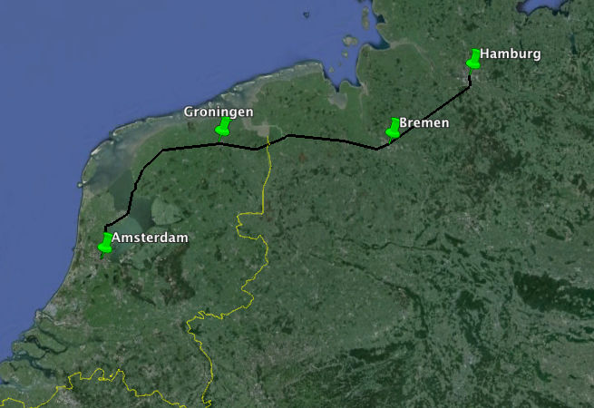
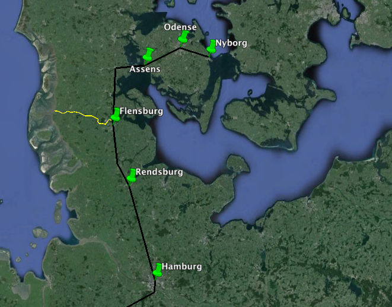
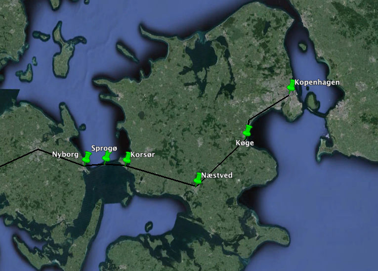
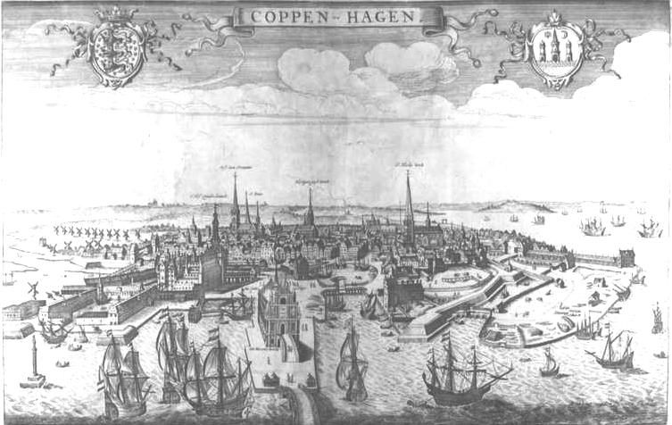
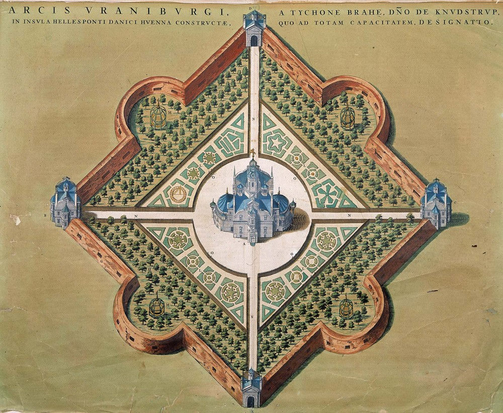
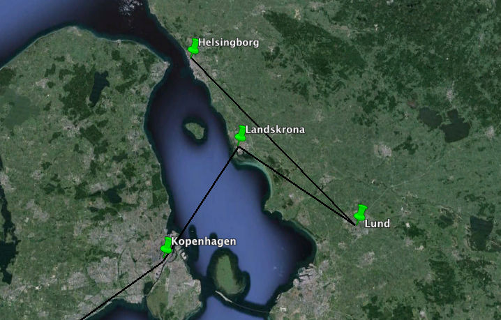
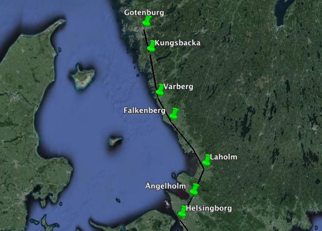
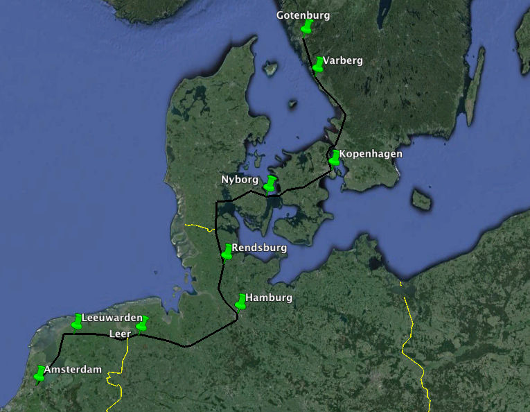

# Reisverhaal van Abraham van der Meersch

~ p. 1 | 1
Reisverhaal van Abraham van der Meersch, geboren te Amsterdam 22 october 1643, overleden te 's Graveland 14 september 1728.

## {sc:De Vlucht Uit Amsterdam}

't Was int jaar 1672 dat den koning van Vranckrijk, Louis de XIV, zelfs in perzoon met meer als 100.000 man dit, ons lieve vaderland, de 7 geunieerde provinciën, onvoorsiens quam overvallen, zijnde geallieerd met den koning van Engeland, Karel de 2 (die vooraf zeer trouwloos onze Smirnse vloot had overvallen, dog met scha en schande was afgekaatst) en met de keurvorst van Keulen en de bisschop van Munster, soodanig dat in wijnig dagen drie provinciën, als Gelderland, Overijsel en het sticht van Utrecht, ondert geweld van Vrankrijk moesten bukken, als zijnde alle onze frontieren, onvoorzien van genoegzame militie, amointie etc., jaa zoodanig dat zijne troupen den 20e junij zig ook meester maakten van Naarden, waar van dienzelven voormiddag al tijding in Amsterdam was, 't welk zoo grooten schrik en alteracie bij groot en klijn in die magtige stadt causeerde dat, bij aldien de France met genoegzame manschap waren voortgetrokken, waarlijk meester van Amsterdam zouden geworden zijn. Deeze alterasie was op dien dag zo groot in Amsterdam dat meenigte van voornaame familien haar elders transporteerde om de woede der France (die men seekerlijk meende dat in Amsterdam zoude komen) te ontwijken. Onder deeze waren ook de famiellie van Jaspar de Flines, mijn overbuurman in de Warmoesstraat, en zijn broeder Sijbrant de Flines, alle met vrouw & kinderen en de kinderen van Cornelis de Flines, die tesamen een smak hadden gehuurt, schipper Jacob Karstens. Dat geselschap bewoog ons met haar in die bevragting te participeeren, invoegen dat wij tezamen nog dienzelven avond, 20 Junij, zijl gingen, elk zo veel goederen bijeengepakt en geladen hebbende als in die korte tijt doenlijk was. Wij verlieten als dan dat droevig Amsterdam, bijna in zulk een verbaastheijt als men

~ p. 2 |
leest dat weleer Gijsbregt van Amstel heeft gedaan. Cours stellende na Hamborg, dog voor eerst op Enchuijzen, daar wij ons des anderen daags van genoegzame provisie versorgde, en vervolgens naart Vlie, daar wij ontrent 100 vaartuijgen, meest gevluchte van Amsterdam, gereet vonden. Daaronder was ook Jeronimus Nunes da Costa, agent van Spangie, mijn goede vrind, voor zijn rekening alleen met 3 smakken wel rijkgeladen. De wind dienden ons soo dat wij den 25 dito in zee raakten en des anderen daags op de Elve voor Staade ten ancker quamen. En 27 dito behouden in Hamborg, dog ik was geheel indispoost, invoegen ik verviel daar in een swaare siekte, dog door Goodes genade in 3/10 weer herstelt. Wij waren dan in Hamborg, daar wij bleeven tot 1673 in september, als wanneer den toestant van ons lieve vaderland weer een geheele andere keer begost te neemen. Naarden was door onze troupen weer ingenomen en vervolgens hebben de France 't geheele land weer verlaaten. Als gezegt, ik quam met mijn waarde huijsvrou en mijn 2 dogtertjes in september weer in mijn huijs tot Amsterdam te lande, over Breemen, Oldenborg, Emden, Gröenninge en Vriesland. Van Harlingen 't huijs. Inmiddels was ik in Hamborg door mijn negotie nog zoodanig geingasieert, tot zelfs in Sweeden, daar men deurgaans vant Hollants crediet geern wat lang profiteert, invoegen dat ik in overleg nam zelfs derwaarts te rijzen. 't Gezelschap daar wij in Hamborg ons meest bijvoegde was (behalve onze rijsbroeders, de famielien van gemelte De Flines)

~ p. 3 |
mijn van oudts bekende vrind Philips van Halmael en zijn broeder Jan van Halmael, Adriaen van Hoek, Pieter de Wolff, Jan de Neufville en 2 van zijn broeders Mattheus & Balthasar etc., die alle ook daar waren om de France eerste furie te ontwijken, die ook alle gelijk als wij, d'een voor d'ander naa, weer na Amsterdam waren gekeert, dog de meeste conversatie was wel geweest, ja bij ons gelogeert, de 2 gebroeders Philips en Jan van Halmael met een dienaar Frederik Paran en wijl zij zeer groote negotie op Sweeden hadden, bewoogen mij van Amsterdam met haar weer een rijsje na Hamborg en Coppenhagen tot in Sweeden te doen, dog wij vertoefden totdat het strengste van de winter mogt gepasseert zijn tot 2 februarij 1674. Maar 't viel, tegens verwagting, heel anders uijt, gelijk in gevolg zal blijken.

## {sc:Amsterdam, Groningen, Bremen, Hamburg}

Wij maakten compangie, Philips & Jan van Halmael, Abraham Vorsterman en ik, en hadden tot onze knegt Frederik Paran. Aldus vertrokken wij als gezegt op 2 februarij 1674 met de trekschuijt over Purmerent op Hoorn en nog dienzelven avond met de wagen van Hoorn tot Enchuijzen, maer dienzelven namiddag begon de wint sterk uijt het Noordoosten te waaijen met strenge vorst. Smorgens 3 dito voeren over op Stavoren. Daar kosten wij geen wagen krijgen om voort te rijden, dus waren genootzaakt in felle vorst op onze Apostelspaarden te marcheeren langs die Vriesse dijck op Hinlopen, daar wij onze bekende schipper eens bezogten, maar kort weer voort op Workum. Daar vonden wij de trekvaart op Bolswaart, reets zoo sterk gevrooren datter geen schuijten voeren, dus marcheerden wij des anderen daags 4 februarij van Workom weer te voet, onze bagasie (bij ons

~ p. 4 |
elk wat verdeelt) en droegen die zelfs, soodat wij op dienselven sondagmiddag tot Bolswaart aanquamen. Daar vonden wij in ons logement een braaf stuk runtvlees nog overt vuur, daar wij ons treffelijk mee verstercte, en na de maaltijt aanstonts weer voort marcheerde langs de trekvaart op Leewaarden, daar wij in den donkeren avond zeer vermoeijt, dog in een goedt logement wel aanquamen. Maer dat ons meest fattigeerde was dat het pat langs de vaart meerendeels onder water lag en toegevrooren, meer als een vinger dik, invoegen dat ijder tree deur het ijs tot over de schoenen, jaa somtijts tot aen de encklauwen, int water moesten passeeren, ider belaaden met onze verdeelde bagasie. Dus quamen wij nog dienselve avond, 4 februarij, soo te voet in Leeuwaarden. Wij verquikten en verversten ons soo veel wij konden, maar egter de vermoeijtheijt trof onzen goede rijsbroeder Abraham Vorsterman soodaanig dat hij snagts de koors kreeg. Wij bleeven daar samen 3 daagen totdat het ijs soo sterck wierd dat wij met handsleeden na Gröeningen kosten voortkomen. Ondertussen verzorgde wij (so veel mogelijk) de herstelling van onze waarde vrind Vorsterman, dog die had vant rijzen zijn bekomst en resolveerde weerom naa huijs te keeren. Ik presenteerde hem weer thuijs te brengen dat hij zeer heus afsloeg en geensins begeerde en hij wagte ook tot hij met een slee weer na Stavoren en soo voort kost overkomen. 't Was dan den 7 februarij, dat de vorst streng bleef continueeren ent ijs kon overdraagen, dat wij van onzen vrind Vorsterman afscheijd naamen en hij weer

~ p. 5 |

{breed}

na huijs keerde en wij des morgens met hand–sleeden van Leeuwaerden op Gröeningen onze rijs vervorderde. Dog 't onroerde mij te zien mijn ook zeer aengename rijsbroeder weerom na huijs te zien keeren en ik in zulk een harden beginzel van soo grooten rijs te continueeren. Mijn lief geselschap dat ik thuijs gelaaten had, trok mijn herte, de kommer voor mijn gesontheijt in deeze strenge ongemakken ontruste mij, maar overdenkende mijn goed oogmerk en mijn aengenaam geselschap zoolang mijn heenreijs duurde, zoo betrouwde ik op des Heeren zeegen en zoo rijsde wij dan voort. Tot Gröeninge bijtijts aenkomende, namen voort een wagen op Winschooten, daar bleven wij dien nagt tot smorgens. 8 dito voort op Lier, voorbij Lieroort daar wij te voet over ijs die rivier, seer glat, passeerde. Wij overnachten in Lier en smorgens 9 februarij vroeg met een wagen op Oldenborg. Voorbij de Stikhouser schans daar wij met de wagen, vermits daar veel water was, deur het ijs heen vielen en quamen de soldaten uijt de schans om de wagen te redden en te helpen. Wij quamen nog droog uijt de wagen. Eijndeling met een fooijtje aen de soldaten raakte wij voort en quamen in de donkeren avond voor Oldenborg aen de poort in de stadtsherberg. Smorgens den 10e dito reeden wij voort op Delmenhorst. Aldaar vonden wij (Delmenhorst gepasseert zijnde) de Weezerdijck deurgebrooken en alt laageland onder water, zodat wij ons met een schuijt lieten vaaren tot aen de hoogte digt na de straatweg die op Breemen loopt. Die moesten wij weer te voet marcheeren, bijna 2 uiren lang, belaaden met onze bagasie, en zo quamen wij tegens den avond heel vermoeijt in Bremen in de Witte Swaen. Dit was maar een begin van deeze moeijelijke vojagie. Hier zal nog meer volgen. Den 11 dito rijsden wij voort d'ordinarij weg op Haarburg, vanwaar wij met paart en slee over de Elff op 13 dito in Hamborg aenquamen, ons logement verkoozen in de Swarte Adelaer in St. Jansstraat. Daar begaaven wij ons om uijt te rusten en onze vrinden te bezoekken. Onderwijle continueerde de felle vorst

~ p. 6 |
met swaare sneeuw soo dat men over al goede sleebaan kreeg. Wij bleeven dan in Hamborg tot den 18 februarij, daar wij smorgens met de slee voortrijsden op Sleeswijk, een nagt op weg tot in Rensborg, een sterke, wel gesitueerde en gefortificeerde vesting onder de koning van Deenemarken behoorende. Maer ik ben niet gesint een beschrijving te maken van ider plaats, stadt, vesting of landtsverdeeling int particulier, wijl ik alleen maar voor heb mijn rijsbeschrijving te doen om mij zo kort mogelijk voort te spoeijen, want zou ik mij ophouden met een beschrijving van alle steeden en plaatsen, haar regeering, situatie en gebouwen te maken, dan moest ik een geheele foliant beschrijven. Alleen sal ik met een woord zeggen dat wij nu vervolgens geen meer vonden van onze geloofsgenooten Doopsgezinde vergaaderinge of gemeentens in deze quartieren meer. In Oldenborg geen, ook in Breemen geen, maar in Hamborg nog een aansienelijcke gemeente, dog die evangelise Lutrianen zijn zo vroom en zoo koppig Luijters dat ze geen kercken of vergadering van andre in haer steeden tollereeren als alleen Jooden bij vergunning. Derhalven moeten alle andre gezinte haer kerkelijke vergaderingen houden tot Altena, ¼ uurs buijten Hamborg. Daar hebbende gereformeerde, doopsgezinde en ook de roomsgezinde haare vergaaderplaatsen. Op den Deensen bodem en in Holstijn binnen Frederikstad, behoorende onder de vorst van Holstijn, die in de troubeltijt der remonstranten ontrent anno 1617 a 1618 previlegie heeft gegeeven, soodat aldaar in Fredrikstad de geheele regeering en hooftkerk aen de remonstranten behoort. En alzo is aldaar ook een aansienelijke doopsgesinde gemeente en vergadering so in de stad, als die ten platten lande in dat vruchtbaar en klaaverrijcke ijderstee woonen.

## {sc:Rendsburg, Assens, Odense, Nyborg}

Wij waren dan gevordert met onze reijze, nadat wij smorgens den 19 februarij Rensborg verlieten. Op de middag plijsterde met paart en slee aent Dennewerk bij Sleeswijk en Gottorff ('tslot of hoff vanden vorst van Holstijn), maar moesten om de sterke sneeuw overnagten op de heij in een arm boerehutje, seer eenzaam. Die arme menschen die daar woonde, waaren egter gesont en wel gemoet. Wij hadden niet lang in dat doorlugtig logement geweest of daar quam nog bij ons logeeren een geselschap dat wij verstonden te zijn een afgesant van den

~ p. 7 |
koning van Vrankrijk, Louis de XIV, met zijn secretaris en twee knegts, die naat hoff van Denemarken rijsden, en schoon men in Holland nog met Vrankrijk in een ruineusen oorlog was, zo waren wij hier schoon overmant (want zij hadden veel geweer bij haar en wij niets dat daar na geleek) vreedzaam, plaijsierig en vroijlijk in onze akelijke tostand, ja zodat dien grooten minister op zijn geheelen rijs van Parijs af geen plaijsieriger uiren had versleeten als deeze nagt bij ons. Hij vertrok smorgens een uir voor ons van daar, want zijn kostbaar geselschap op de weg dienden ons niet in onze pottage en alzoo bonjourde wij hem en volgde nog tijdig in de morgenstont 20 februarij op dat plaijsante Flensborg, geleegen in een lustige valeij aan de zoom van de Oostzee, omringt met seer vruchtbare en lustige heuvelen, die aan de inwoonders in die groote lange straat bijna voor ijder huijs een altijt springende fontijn van delicaat water verschaffen, maar wij hieuwen ons hier niet lang op. Maar ons wat gewarmt en wat ververst hebbende, spoeijden voort sodat wij nog dien avond vorderde voor bij de eerste stad in Jutland, Hadersleeve,, tot aent veer dat aen de Oostzee of Kleene Belt legt om over te varen op Assens int eijland Funen. Den 21e dito, mettet aanbreeken van dien zeer kouden morgenstont, vervoegden wij ons op den oever aen de zee om te overleggen hoe men zou overkomen. Men reekent aldaer dat de Kleene Belt tot aen Assens op Funen ruijm een duijtse mijl weijd is. Men zag geen opening, maar wel bergen van sneeuw en opgeschoote schotzen ijs. Goe raad was hier duur. Niemant had nog durven bestaan om over ijs te passeeren, dog wij verstonden datter ijs al eenige dagen had vastgeleegen ent vroor seer fel bij continuatie zodat wij resolveerde de eerste te weesen om in de Belt over ijs te passeeren, nadat wij eerst een man met een swaare bijl vooruijt hadden gezonden om, al kappende nu en dan, de weg te baanen. Dus begaven wij ons ten ijs in een slee met 2 paartjes en nog een man met een bijl voor ons op een drafje, die zoo nu en dan int ijs kapte om te probeeren of hij doorsloeg. En dus koos men de weg over de dikste, aaneenbevroore schotzen, somtijts als tussen de ijs

~ p. 8 |
bergen heen en zonder water te zien. Quamen in ontrent 2 uiren over en tot binnen Assens, de eerste stad opt eijland Funen. Dat vrugtbare eijland Funen, dat nu so dor en zo dood als ijs was, daart bij somertijden (nu reets zoo nabij) zoo vol vee en overvloet van graanen staat, ja een land dat van vruchten en van melk en honing vloeijd. Daarom valt de meede daar seer abondant en delicaat. Gansen en kalkoenen van ongemeene swaarte, de alderfijnste ossen die ik oijt gekent heb, worden hier gequeekt en die ik zelfs int beweijen ook zoo hebbe bevonden, zoo wollig, zoo fijn, zo milt, ja soo dat ik geen beter ken, maar wijnig kleender als de Jutze ossen. Wij spoeijden ons van Assens voort, opdat wij nog dien avont tot binnen Odenzee, de hooftstat van Funen, mogten geraken, gelijk wij ook met den avond 21 februarij binnen Odenzee quamen. Om van deze hooftstad Odenzee veel te zeggen sal ik voorbij gaan. Vooreerst maakt de dikgevalle sneeuw en langdurige felle vorst morsig, vuijl en ongesiene straaten en huijzen. Behalven dat so ontmoeten u hier ook wijnich deftige gebouwen of palijzen in geheel Denemarken, maar, als gezegt, vruchtbare landsdouwen en is hier ook niet bergagtig. Wij rusten hier & vonden een goede maaltijt, goede mee en goed bier of eul. Wij vroegen na wijn, maar die wasser niet, nog ook geen wijnkooper in de heele stad te vinden. Eijndeling de waerdt ging na den apothecar, daar vond hij eindeling wijn en dat was juijst een man die in Amsterdam was geweest en bekent bij mijn rijsbroeder Van Halmael. Die onderhieuw ons wat met vertellinge. Eijndeling wij gingen te rust in zeer zagte bedden, wijl men daar overvloet van schoone ganseveeren en dons heeft. Smorgens den 22 februarij vertrokke voort op Nieuburg, geleegen aen de oostkant van Funen aen de Groote Belt, alwaar wij gingen logeeren bij de burgemeester, een seer deftig en fatzoenlijk man, int huijs, sindelijk en net. Deeze burgemeester was ook meteenen een koopman, die veel braave lieden in Amsterdam bediende in verkoop van goederen & inkoop zoo van mout, garst als andersins. Dit steedje Nieuburg quam mij ook netter en ordentelijker voor als Odenzee. Men kost hier uijt ons logement tot in zee zien. Eer dat wij hier in Nieuburg binnen quamen, ruijm een uur vandaar

~ p. 9 |

{breed}

wierd ons vertoont die plaats daar die bloedige batalje te lande was voorgevallen doen de Sweeden, met al haar geschut en ammonitie, de Groote Belt over ijs, anno 1658 in die felle winter, uijt Zeeland of Fumen waren gekomen en onzen staat tot assistentie van Deenemarken een vloot onder den Admiraal de Ruijter met 6000 man landmilitie tot Nieuburg afzond. Alwaar ons volk (ondert faveur vant gedurig Canonneeren uijt de scheepen) aan land geraakte, daar den bekende Buat de eerste was, die nog tot zijn middel int water sprong omt volk aen te moedigen, dat alles zo wel gelukte dat al ons volk in ordre aen land quamen en met de overige Deenen etc. nog kosten conjugeeren, zelfs int gezigt vant fictorieuze Sweedze leeger, niet ver van daar gekampeert, die zoo trots en verwaant waren dat ze onse soldaten maar voor hontsfotters en jongens agtede. Maar 't duurde niet lang of men raakte aan malkander. Daar was de slagting groot. Die fictorieuse & moedige Sweeden, die heel Polen gedwongen hadden, nu, so deuroeffende en ervaaren soldaten, vielen op de onze met zulk een furie in en zo verwoet als of ze ons in eenmaal zouden overstroomen. Maar de burgemeester in Nieuburg verhaalden ons dat de onze een krijgslist gebruijkte dat ze eenig kanon tussen haar linien hadden geplaast met seer ervaare constapels en met schroot gelaaden, die in den aanval vant Sweedre leeger los branden, en maakte geheele straaten int Sweedre leeger. En daar bij stont ons voetvolk aldaar als een metale muur, sodat de Sweeden niet een voet breed kosten avanceeren en eijndeling geheel over hoop geraakte en totaliter wierden geslagen, gevangen en gedood en al haar kanon, tenten, etc. tot buijt gelaten. Niemant ontkomen, want men was op een eijlant, als alleen de graaf Steenbok & Oxensteen, die met een kleene boot de groote belt over vlugte na Casseur, daar den koning Karolus Gustavus was, om hem deze noijt gehoorde neerlaag te brengen, daar maar 2 man van een geheel leeger afkomen. Waarop de koning ook zoo ontstelde dat hij deze 2 ook wel had willen weerom senden.

~ p. 10 |
Dit drukte dien victorieuse vorst, dit kost hij niet opkroppen. Hij trekt terug, verlaat Deenemarken, komt weer in Schoone, trekt na Gottenburg, word daar siek en sterft. En Fredericus Tertius, der Deenen koning, was alzo verlost van zijn grootsten vijand met groote verpligting voor de veerdige bijstant van deezen staat, want geheel Deenemarken was al weg behalven Coppenhagen. Helaas! Wat is den oorlog een grouwzaam beest, door de Israëliten noijt ondernomen met eenig succes als op expres bevel van God den HEERE om dat volk uijt te roeijen dat hem niet erkende of wilde erkennen, maar een Christen heel anders beroepen een strijd alleen tegen zigzelfs en die daar overwint sal alles beerven etc. Deze gemelde burgemeester van Nieuburg was ooggetuijge geweest van dit grouzaam gevegt en wistet met veel distinctie heel smakelijk te vertellen, want hierdoor raakten zij met een slag van veel onrust en overlast verlost. Dien avond, 22 februari, verlustigde wij ons met onzen hospes de burgemeester, terwijl zijn brave vrouw bezig was een seer groote, vette kalkoen voor ons te braaden, tot een avondmaaltijt, nevens meer andere gerechten. Ook was daar goede wijn, goede meede en puuijk van eul. Wij overleijden vast met onzen hospes hoe wij smorgens best over de Groote Belt zouden geraaken die nog open lag vol van drijvent ijs. Hij berigten ons dat de goeverneur van Funen, de heer overste Citchenon, ook voorneemens was smorgens, alst goed weer mogt zijn, met 2 dienaars over te varen. Aanstonts ging hij zelf om dien heer overste te spreeken, die hij seer verblijd en geneegen vond dat wij in zijn geselschap tezaamen compangie zoude maken en daarop gingen wij, na die delicate maaltijt, elk na de ruste.

## {sc:Sprogø, Korsør, Næstved, Kopenhagen}

Den morgenstont op den 23 februarij vertoonden hem seer helder en klaar met strenge vorst.

~ p. 11 |
Omtrent ten 9½ uur begaven wij ons alle met goede genoege scheep in een boot met 6 roeijers en een stuurman, de heer overste met zijn 2 knegts en wij met ons 4'en, samen 14 menschen, en staaken wij zoo van land. Langs de wal vonden wij oope water, maar zaagen van verre groote ijsbergen drijven die wij moeste naderen. Hier was een sterke drift int water naat noorden so dattet ijs seer sterk dreef. Hier, nog in de geheele Oostzee, gaat geen eb nog vloet gelijk in de Noortzee en soo ook niet in de Middelantze Zee. Nog ook niet in de Pontus Euxinus, die zijn uijtgang heeft voorbij Constantinopolen, door de Dardanelles na de Achipellagus en de Middelantse Zee. Nog ook niet in de Caspise Zee, die rondom beslooten is zonder uijtgang, alhoewel gezegt word datter in de Caspise Zee diverse draaijkolken zijn diet water onder de aerde door na de Sinus Indicus, of na de Pontus Euxinus, zoude loozen. Maar ik heb een voornaam Persiaen self gesprooken, die driemael de Caspise Zee was gepasseert, maer de had nooijt soodanige kolken vernomen, nog gezien, alhoewel het seeker is datter wel eenige uijtloosing moet zijn, dewijl veele voorname rivieren in de Caspise Zee heen stroomen, als de Wolgda door geheel Muschovien voorbij Astrachan in dezelve heen storten, nevens diverse andere voorname rivieren. Dit impassant aangeraakt hebbende, laat ik dit verder ondersoek den weetgierigen bevolen als zijnde hier buijten mijn bestek. Wij quamen dan, eeven als of wij in Groenlant waren, tegens die vervaarlijke ijs–drift aan en tragten een opening te vinden, gelijk wij eindeling plaats vonden, en int ijs tussen beijde in eenige opening in roeijde, maart duurde niet lang of wij wierden zoo bezet in die ijsbergen dat wij in groot gevaar waren van stukkent geklemt te worden, maart gelukte dat wij een groot velt van swaar ijs voor de boeg kreegen. Daar op volgde soo swaare ijsbergen

~ p. 12 |
met zulk een snellen drift die ons seekerlijk in de grond en tot spaanderen zou geknelt hebben, ten waare den schipper met groote verbaastheijt riep: “Haast u, haast u, spring alle opt ijs”, gelijk flux geschiede. En men haalde de boot met alle man zeer veerdig opt ijs soodat soo immediaet 't gewelt vant ijs agter tegens de boot aendrong met zulk een kragt dat alt ijs dreunde, scheurde, en kraakte, alhoewel dat velt ijs wel 3 voet dik was, sodat indien wij een ogenblik langer gesammelt hadden wij zeekerlijk alle verlooren waren geweest. Hier stonden wij op die schots en dreeven zoo heen met onze boot. Dus wandelde wij in zee op een schots ijs, deurkouwt in felle vorst en niet min benaauwt, totdat wij eindeling aan de andere zij van de schots weer opening zaagen. Doen met alleman aant trekken van de boot over de schots heen en dus geraakte wij weer int water, dog 't duurde niet lang of wij quamen weer int selve gevaar en weer ter vlugt de boot uijt opt ijs, daar wij soo lang mee heen dreeven dat den avond al begon te vallen en mistig, dat onze benaauwtheijt verswaarde. Dog wij haddent klijne eijlandje Spro int gezigt gekreegen dat int midden van de Groote Belt tussen Nieuwburg en Casseur inlegt, dat wij soo opt ijs drijvende begosten te naaderen. Eijndeling, eer dattet nog donker was, vonden weer wat opening, sodat wij ons spoeijden en quamen behouden aen dat eijlantje Spro aen landt. Dat eijlantje is niet wel een half uur gaans int ronde groot. Daarop staat een huijsje met een schuur, opdat daar lijfsberging zou zijn, in alle occagien voor ongemak, door den koning bezorgt. In dit arm gestel daar trokken wij in met al ons geselschap en bagasie, alhoewel het bootsvolk in de schuur ging. Hier waren wij op vast land, maar de geheele nagt hoorden wij het ijs met groot gewelt tegen den oever kraaken en opschuijven tot geheele bergen.

~ p. 13 |
't Was waarlijk of wij aan Nova Sembla waaren. Daar timmerde men ook maar een huijs om te overwinteren, maar dat den druk verzagte was dat wij ons hier braaf wat te goede kosten doen. Den heer overste Chitchenon was een braaf man, seer gemeenzaam, die ook gouverneur was geweest in Bergen in Noorweegen anno 1665, doen onze Oostindise retourvloot daar lag en van de Engelse oorlogsvloot wierd aangetast en vernielt of genomen te worden en door hem so deftig wierd gedefendeert dat de Engelse met schande moesten afwijken, want zij kreegen daar ham sonder mostert en onze Oostindise scheepen bleeven alle behouden. Door zijn auctoritijt wierden wij hier wel opgepast. Den Boer, of heer van dit heele eijland, of dorp van een huijs, (wel Barrataria daar Chanca Panca gouverneur was) stookte braaf in en besorgde zo veel vars stroo int heele vertrek als wij alle om te rusten noodig hadden. Maar vooraf opende den heer overste zijn fleskelder & proviantkorf & wij ook de onze. Daar was alles ten besten, 'twas of wij alle broeders waren, want wij waren met groot prijkel tot hier gekomen. Wij maakte alle veel lust en plaijsier omt gevreesde en geleede ongemak te vergeeten en wij deeden een deftige maaltijt, soo van spijs als drank en agter na een wonderlijk, delicaat guldewater van den heer overste, en daar me alle opt stro te rust. ALST BUIJTEN WOED, IST BINNEN SOET. Den 24e februarii wekten ons de morgenstont met helder weer. Ik was geensins de laaste bij de wercke en stapte met het eerste licht na buijten. 't Was niet ver vant huijs daar ik een hoogte zag, daar opkomende bevond aan de vervalle ruine dat daar weleer een kasteeltje of fortresje was geweest, maar nu bijna tot de grond vervallen.

~ p. 14 |

{breed}

De stralen van de zon quam door de omwenteling die den aerdkloot op zijn assen alle 24 uiren maakt, deese kant des weerelts wederom liefelijk beschijnen en verligten, sodat ik rond om van mijn af kost zien en bevond dat onse passage van daar tot Casseur open was en bijna sonder ijs. Des spoeijden ik mij bij ons geselschap en presten elk aan, sodat wij alle int kort scheep raakte en dit eijland Spro verlieten en sonder ongemak nog voor de middag tot Casseur in Zeeland behouden overquamen, alwaar wij tezamen ons nog wat verversten en afscheijd namen van onzen heer oversten met veel beleeftheijt. Hij nam de naaste weg over Ringsted na Coppenhagen, maar wij bezorgde een slee na Nested, daar mijn geselschap wat te doen hadden, en aldus begaven wij ons na de middag ook op rijs. Maar 't begon op de weg so vervaarlijk te sneeuwen dat men qualijk zien kon, ja wij vonden daar bergen van sneeu, boerehuijzen hoog, en de weegen op veel plaatzen zoo hoog opgevult en van de wint opgejaagt datter de boeren, om passabel te maken, moesten doorgraaven. Dit weer veroorzaakte dat wij na ons bestek dien avond Nested niet kosten berijken, maar introkken in een eenzaam boerehuijsje, armelijk. Daar opende wij onze schagtel en hadden daerin een groote, vette gans, nog raauw, die ons die brave burgermeestersvrouw van Nieuburg tegens de rijs had bezorgt. Wij maaken van een lange stok een spit, staaken de gans daaraen & brieden hem wel gaar en seer delicaat en maakten onze nagtrust als voorn weer in goed stroo, nadat wij onze fleskelder ook eens besogt hadden. In den morgenstont den 25e dito maakten wij ons al vroeg weer veerdig om na Nested te vorderen. Wij vonden de weg wegens de veelvuldige sneeuw seer moeijelijk, sodat wij seer lankzaam

~ p. 15 |
voortraakte. Dog digt voor de stad komende, wilde onze koddige Deensen voerman nog op een helderen draf zijn aankomst maken, maar vermits den holbolligen weg slingerde de slee omver en wij alledaar uijt. En Jan van Halmael, de dikste, slingerde teegens een boer, die neevens de slee opt voetpad ging, soo dat de boer om veer en Jan van Halmael op zijn lijf viel, waarover den boer soo begon te vloekken en te raasen dat hij ons alle verbaast maakte. Ja, hij wilde betaalt weesen voor dat men hem opt lijf was gevallen. Hier was geen bidden voor. Hij wou gelt hebben. Eijndeling wij begosten alle te laggen en paktent goed weer in de slee, maar den boer bleef volharden om gelt voort vallen op zijn lijf met groot gewelt (sommige zouden hem stokslagen geeven of wijzen hem na de voerman die de slee om gesmeeten had, maar wij, met meedoogen bewogen, gaaven den armen boer 2 stuivers en daar mee wier die val geboet). En de boer seer voldaen en gestilt, en wij alzo gerust de stad in nog voor den middag, daar wij dien dag voort uijtrusten en mijn geselschap haar zaaken verrigten. Des anderen daags, 26 dito, spoeijden wij ons en vertrokken van Nested op Kiög, leggende aan de Oostzee aen de Kiögerbogt, dat een deftige baaij is daar veeltijts de Deenze oorlogsvloot verzaamelt als op een veijlige zee. Daar hieuwen wij ons middagmaal en rijsden voort, zodat wij tegens den avont tot Coppenhagen binnen geraakten en gingen daar logeeren in die koninglijke hofstad, op de Amakkermart int Lekkerbeetje, daar wij ons zeer deftig kosten uijtrusten. 't Was een seer aenzienlijk logement, daar wij voor een siviele prijs deftig getracteert wierden.

## {sc:Kopenhagen}

Sie daar vrinden, nu ben ik in Coppenhagen in zulk een plaijzierig saijsoen, de residentieplaats van de tans regeerende

~ p. 16 |
koning Cristianus Quintus, een goedaerdig vorst, broeder van prins Jurge, getrouwt met princes Anna in Engeland, die na koning William, als koningin Groot Brittanje regeerde. Deezen koning Cristianus heb ik doen diverse reijzen gezien, ook eens in zijn hoffkapel, daar int Deensch voor hem gepredikt wier. Ik konder wijnig van verstaan, maar den Phar Herr had dog goede mienen en ordentelijke gesten, veel zeediger als magister Lang in Hamborg. Die teerde en battemente op den kansel, als een broer Cornelis te Brugge. Men vint onder Luterianen ook al veel koddige quanten. Wij vertoefden dan in Coppenhagen van 26 februari tot 27, 28 dito den eerste en 2 maert. Tussen beijde bezagen wij het notabelste. De stad legt wel gecitueert en wel geforticiceert. Alles is daar van leeftogt abondant en goed– koop. Over 3 a 400 jaren zijn eenige familien uijt Vriesland daarheen gelokt en geplaatst op Amak zijnde, zijnde een vet en vruchtbaar eijlantje dat met een brug aen Coppenhage gehegt is. Deeze Vriessen en nu Amakker boeren zijn tans zo vermeenigvuldigt dat dit geheele eijlandje nu alleen van haar lieden bebouwd word met vee, boter, melk en moeskruijden, even gelijk de kinderen Jacobs het vetste van Egipten, het land Gosen, bewoonde. Het vernieuwde mij doe ik op een martdag de geheele mart in Coppenhaege vervult zag met deeze boeren en boerinnen in hun onveranderlijke, sindelijke boeredragt opt Fries, in haer ongesteeve witte linne mutsjes, lijfjes etc., en de mannen met een geplakt kraagje en een Vriesse drommede muts opt hooft,

~ p. 17 |

{breed}

met hun allerlije moeskruijden, boter, melk, hoederen, druijven etc. Ik sprak een van deeze lieden aan, want zij quamen mij voor als die oude Vriesse doopsgezinde, maar niemant kon mij verstaan, spraken niet anders als Deensch en waren alle Luijters geworden door verloop van tijd en door gebrek van bequame leeraars der doopsgezinde, daar veele van haar maagschap in Vriesland bijbehoorde, zo mij verhaalt wierd. Wij waren dan in Coppenhagen tot 2 maert en bezagen alles wat notabel was. Kerken, toorens, daar onder dwerre die fraaij zijn, een die de spits op 8 vergulde groote ronde bollen, so groot wel ider als een bierton, gelijk St. Nicolaestooren in Hamborgh, nog een tooren die plat is en binnenswerk int ronde sonder trappen schuijn opgaande, sodat men te paart tot boven toe zou kennen opreijden. Men vinter ook fraje orgels. De beurs is een groot langwerpig vertrek, geheel met een dak, met een braaf uijtzicht over zee, sodat men aen de overzij de Sweedze kust, zelfs Landtskroon en Malmuij, van daer kan beoogen. Op die beurs staat een aerdig toorentje. Op de voet rusten vier slangen met de kop op ider hoek van de voet ende staarten opwaarts dooreen gedraaijt of geslingert en dat maakt den toorn, dat heel konstig gemaakt is en aardig vertoont. Het hoff van den koning is heel oudt sonder groote pracht met een braven hoff, waar langsheen aan de oostzij hokken gemaakt zijn, ider ontrent 15 a 16 voet int vierkant, daar allerlij wilde beesten in ider zijn, als een leeuw, beer, wolf, tijger etc. voor met ijzere traliën. Ik stond en speculeerde op den tijger die agter in een hoek digt ineengekrompe lag. Ik hitste hem wat aan dat hij op

~ p. 18 |
sou komen om hem ter deegen te zien, dus maakten hij een sprong als een kat tot voor de tralij en sloeg met zijn klaauwen na mij toe dat maar eeven mis was, dat mij seer verschrikte en zelf den oppasser verbaasde. Het quam mij voor, doen ik die tijger wel bezag, alsof de katten wel eenigzins vant geslagt der tijgers waren, gelijk sommige honden vant geslagt der wolven. Ik wijk te ver van mijn bestek. Wij moeten ons niet langer ophouden, maar ons weer gereet maken tot onze rijs. Het vriesent weer continueerde van dag tot dag eeven streng, soodat men met paart en slee dagelijks de Zont over ijs passeerde van Coppenhagen tot in Sweeden, als over een gebaanden straatweg.

## {sc:Landskrona, Lund, Helsingborg}

Wij namen dan afscheijd van onze compangie, die dagelijks in ons logement bij ons ter maaltijt quamen. Dat waren de heeren ambassadeurs van onzen staat, van Vrankrijk, Sweeden, Brandenburg etc., welke laaste ons in drie dagen uijt de naam van den koning versogt met hem ten hoof te gaan, alzo den koning van haar verstaan hadde datt er eenige Hollantze kooplieden waren in hun ordinaris gelogeert en den koning geern met zoodanige tot voortzetting van negotie discouraerde. Maar wij excuseerde ons beleefdelijk, wijl wij onse rijs moesten voort zetten. En wij bestelde een slee met 2 paarden, die voor ons logement op de Amakkermart ons quam afhaalen smorgens 2 Maertii. En zoo passeerde wij over ijs van Coppenhagen de Zont over tot wij te Lantskroon in Sweeden weer uijtstapten. Ter halverweegen lagt het eijlandje Ween, daar wij digt langsheen passeerde. Dit eijlandje, Ween, was de woonplaats van den beroemden mathematicus Tycho Brahe, die aldaar een aansienelijke wooning had gebouwd. Hier had hij in ordre zijn museum, zijn labrotorium en zijn observatorium, met een groot plat opt huijs om in een open lucht des aardrijks en hemelsloop te beschouwen en hun geheele wijde uijtgestektheijt. Deesen Tycho Brake was de man die tegens het gevoelen van

~ p. 19 |

{breed}

Ptolomeus en gelijk Copernicus leeraerde dat den aardkloot in een etmaal rond–draaijde en de maan zijn licht als in een spiegel van de Son ontfangt en gelijk ook als een weerelt op zigzelven is en van alle de hemelsligten ons de naaste is, so verre van ons, en zijn maandelijke draaijkring rondom dese werelt maakt en dat ook de 5 andere planeeten, als Jupiter, Venus, Mercurius, Mars en Saturnus, ook als de maan, van gelijke gesteltheijt waren, dog in groote en verafgescheijdenheit van de aard–kloot veel verscheelde, dog elk hun ordentelijke loopkring maakte etc. En verder dattet groote hemels–heijer der vaste starren alle, elk als een Son, van ons bijna als een onafmeetelijke afstand hadde etc. Om mij tegenwoordig met deeze ondersoekinge en bedenkinge langer op te houden, sou ik te verre buijten mijn bestek gaan. Derhalven wil ik den weetgierigen astrologise beminnaars wijzen na de beschrijvinge van Descartes, Abraham de Graaf en Huijgens, maar ons bepaalt verstant is veel te gering om alle de onbepaalde wonderen des hemels met gewisheijt te doorgronden. Daarom sal ik dit discours, so in passant, ontrent en voorbij dit gemelde eijlantje Ween passeerende overdagt, besluijten en zeggen met dien Goddelijke gezant: “O! Diepte des rijkdoms, beijde der weijsheit en der kennisse Godts, en wie heeft den weg des Heeren gekent, of wie is zijnen raadsman geweest.” En laaten wij maar tot onsselven inkeeren. Daar is een kleine weerelt, die nog van niemant regt bekent is, en laat ons niet allen tragten te profiteeren van de boom der kennisse, maar van den boom des leevens. En segge met den stichtelijke rijmer:

“De heel natuur wil ons verstandt door delven, elk denkt om veel, geen mensch schier om zichselven.”

~ p. 20 |
Wij quamen dan den 2 Maart 1674 omtrent smiddags met 2 paarden voor een slee van Coppenhagen over ijs als over land in Sweeden tot Landtskroon en nog des avondts in Malmuij, op de hoek van de Oostzee geleegen, zijnde 2 seer sterke vestingen. Wij hadden daar in Malmuij maar met een man te doen, daar wij aanstonts gedaan werk mee maakten, en spoeijden ons des anderen dags, 3 Meert, na Lundun, daar wij al goetijds aenquamen. Dit is een open plaats, wijd uijtgestrekt. Daar is een universitijt en een seer groote, oude, aanzienelijke kerk, die wij tezamen gingen bezien. Is twee verwelven boven malkander, zittende op een groote meenigte, seer swaare pilaren. Ik zag aen een hoekpilaar als aen geplakt, dog eenigsins als vereenigt met de pilaar, (quasi) als een afgebeelden duijvel met hoorens en paardevoeten, slingerende om de pilaar, gelijk ook zijn armen als met force de pilaar aangrijpende. Ik vraagde heel stemmig aen de koster, die ons de kerk liet zien: “Wat is dat?” Hij antwoorde seer aandagtig: “Ja Herr, dat is eijn gants wonderlich mirakel geweesen, tot eijn eeuwig aendenken.” Wij verzogten de zaak te weeten. Zoo verhaalde hij met een staatig weeze, even gelijk de papiste alsse de staart van Biliams ezel laten zien, hoeveel rijzigers van alle quartieren daar quamen om dit wonderwerk daar te zien. 't Was dan zulks dat over meer dan 1000 jaren den koning voor had alhier zoo een groot gevaarte van een der grootste kerken van geheel Sweeden aldaar te stichten. Aldus ontbood hij een voornaam architect en konstig bouwmeester om op so een bestek

~ p. 21 |

{breed}

so een magtig gebouw aen te besteeden, waartoe de matrialen bijder hand waren. Men raakten accoord – en de betalinge bij termijnen te voldoen, mits binnen soo een bepaalde tijt volbouwd moest zijn. 't Werck ging zijn gang met groote drift, dog onder de hand bevond den bouwmeester een onmogelijkheijt om binnen dien bepaalden tijt gedaan werk te hebben en alzoo versteeken van een groote gedeelte van de geaccordeerde penningen. Hier was de benaautheijt groot. Wat zou hij doen? Goe raad was duur. Hij resolveert met den duijvel aan te spannen. Den duijvel compareert op de eerste cituatie. Kleene swarigheijd voor den droes om te helpen bouwen en de kerk voor de bepaalde tijt volbout te maken, want dien duijvel was een duijsent konstenaar. 't Werk avanceerde na wensch. Kans wasser om nu int kort gedaan werk te hebben. Dien duijvel (die seer geltgierig was) spreekt om geld, tenminsten om een groot gedeelte van de geaccordeerde somma. Den bouwmeester trekt ten hoof om de geaccordeerde somma te besolliciteeren, maar kost niet op doen, wier uijtgestelt tot de volkomen volbouwing vant werk. Dus trekt hij weerom. Maar sinjeur den droes wilde hem met geen praatjes, nog belofte laten paajen. Gelt was de bootschap. Denkt eens, soo is den duijvel verzot op gelt. Waartoe meer woorden. Men raakt aent kijven, waardoor den droes soo boos wier dat hij na deezen hoekpilaar toevloog om die weg te rukken, want hij was stark, en om alzo dat geheele gebouw te doen neerstorten. Maar in dit aangrijpen en omarmen van dien grooten pilaar veranderden hij aenstonts in steen, so aangekleeft aen deeze pilaer, als aengemetzelt, en zoals aldaar van duijsende menschen bezogt en nog gezien word. Wat dunkt uw van dit Luijtserse sprookje? Niemand van ons dorst hier teegens spreeken, want de man verhaaldent als een evangelij, en heer Jan van Halmael onder des trok heel stemmig een seer vreemt bakhuijs, sodat wij ons beswaarlijk van laggen kosten weerhouden.

~ p. 22 |
Na deeze koddige versnapering (die mettet zien van alde actiën die in dat verhaal voortvielen was wel eens soo veel gelt waers als 'tons koste) spoeijde wij ons weer tot de rijs, soodat wij nog zoo spoedig voortraakten dat wij nog dienzelven avond binnen Elsenburg geraakten. Des anderen daags, den 4e maart, wast sondag. Doen had ik smorgens bijtijts geern voort gerijst, maar onzen tractabelen hospes had savonts tevooren veel wild gekreegen haazen, een wild swijn etc. Die bewoog mijn geselschap aldaar te blijven om daar eens wel getracteert te worden en waarlijk 't was alles seer delicaat en seer wel geprepareert. Onder des dat de spijze bereijd wier ging heer Philips van Halmael te voet over 't ijs, hier van Elsenburg over de Sont na Elseneur, daar hij met Jan van Deurs eenige zaaken te verrigten had. 't Was een uur gaans heen & zo ook weerom, dus quam hij voor de maaltijt weer bij ons en was alzo uijt Sweeden eens heen en weer in Deenemarken geweest. Die delicate maaltijt geeijndigt zijnde, sprak ik weer van voort te rijsen, wijl mijn tijt te zeer bepaalt was, maar ik kost mijn geselschap niet beweegen te vertrekken, dus sprak ik met den weerd of ik wel aanstonts een slee kost bekomen. 't Was gewis een die mij nog dienzelven avond binnen Engelholm zou brengen. Soo gezeijd, zoo gedaan. De slee quam, ik nam afscheijd, alhoewel mijn vrinden gevoelig waaren dat ik soo veel haast moest maken en ik zoo eenzaam in een vreemd lant van haar afging, maar mijn drift joeg mij kort na huijs en ik trok voort in een felle vorst, nadat ik alvoorns Reis had effen gemaakt de voiture van de slee geaccordeert en betaalt om mijn dien avont te brengen in Engelholm,

~ p. 23 |
des anderen daags in Congsbag en dan voort in Gottenburg. Den tijd was ondertussen al ver op de namiddag heen geloopen, sodattet later was geworden als wij dagten. Egter ik moest doen voort met mijn sleetje van baste van boomen gemaakt en 2 Sweetze knolletjes daarvoor en een lange magere Sweedse rabboort tot mijn voerman, dus reed ik heen. Het differeerde veel mij aldus te zien vergeleeken bij de narren op den Amstel of langs de Heeregraft te praalen. Eenige tijt soo eenzaam gereeden hebbende, soodatter nog huijs noch mensch te zien was. Wij avanceerde tot in een groote bosschagie, bergen en daalen. Ik zogt een praatje te maken met mijn voerman, maar de vent kost niet een woord Duijts. Daar zat ik. De son daalde ent vroor seer streng. 't Eenige dat ik zeggen kon, was: “Jij moet koere froom, jij schal ha drinke pennij.” 't Sweepje ging wel, maar de katjes gingen soo op een hontsdrafje langs de sneebaen haar gang door hegge, struijke, digte, naare bosschage, hoog en laag gebergte op en neer, daar men hier en daar een opgeknoopte wolf aen de boomen zag hangen totdattet eijdeling heel donker begon te worden. 't Wier laat en ik wier bang en deurvrooren van kouw. Wat zou ik doen daar nog huijs nog mensch te zien was? En groote vrees voor wolven of andere wilt gedierte, eijndeling al gedurig uijtziende in dit donkere naare geboomte of wildernis, dat hem in zee hoog op doet en van zeelieden het Kol genaamt word, daerse moeten hensen die er noijt geweest hebben. In die gestalte soo al voortrijdende, sonder dat ik kost te weeten komen hoe ver wij nog van Engelholm waren, dat mij aen de woestheijd nog ver van ons af scheen. Dus eindeling zag ik vooruijt, wijnig ter zijen af, een ligje. Ik wees mijn voerman daarheen, want de duijsterheijt en de felle kouw dwong mij. Op de hoogte van dat hutje komende, reeden wij die passage in. Ik stapte voort huijsje af, maar kon geen deur vinden, dog met stommelen en roepen wierter een deurtje open gemaakt,

~ p. 24 |
heel laag, daar ik braaf mijn hooft stoote. Ik quam binnen in dit arm hutje. Daar stont een groote schrale, lange vent bij een kaggeloventje van klij, een wijf met een kint in een wieg die van uijtgeholde blok gemaakt was, een tafel van twee rouwe planken, daar agter een breede bank als met sijlgoet overtrokken. Daar ging ik op zitten aan die tafel ent wijf voor een bedstee. De vent keek mij aan met een vreemt gezigt en een open mont, terwijl mijn voerman met zijn peertjes in een schuurtje was, terwijl liet ik braaf in stooken, want het houdt had men daer voort hakken en dat was ook het beste tractement dat ik genood. Ik vroeg (om begin van discours te maken) aan dezen castelijn van dit doorlugtig heerelogement: “Haaf jou brand win?” 't Antwoord was nee. Wederom: “Haaf jou eul?” Doen gaf hij mij een groote kit, onder wijd en boven naauw. Ik zetten die aen de mont en proefdent, maar 't scheen mij toe dattet water was met wat stroop gemengt. Ik maakte mijn valies open en had in mijn tinne flesje nog wijnig brandewijn. Ook een doosje met anijsbrootjes, door moeder mij meede gegeeven, daar ik mij meede verquikte. Hier kost niemant Duijts, dus moest ik in overdenkinge dit leeven zoo wat aanzien met wel angst & vrees verzelt. Doen wensten ik wel dat ik bij mijn goede vrinden was gebleeven, maar dat kon niet baaten, want had mj hier iets quaadts overgekomen in deze woeste, afgeleege wildernis, immers zou noijt mensch geweeten hebben waar ik gestooven of gevloogen zou zijn. Ik had mijn valies bij mij, dat zag hij, mijn rijsmantel en mijn kleeding. Daarbij kost die boer heel wel aen mij zien dat ik ook wel rijsgelt had en ik gans weereloos sonder stok of swaart. 't Wier laat, dus sonder spreeken, stapten die boer ook int bed. Ik prepareerde mij ook wat te leggen, maar niet om veel te slapen. De bank was mijn ledikant, 'tvalies mijn hooftkussen,

~ p. 25 |
mijn mantel sloeg ik om mijn ooren en zoo leij ik mij terneer en beval mij Godde in zijn genadige hoede, nadat ik braaf ingestookt had, want het was daer bitter koudt. Wij hadden gehoopt, doen wij vertrokken, een zachte voortijd te ontmoeten, maer 't viel heel anders uijt en, daarbij, wij rijsden meest noord aen. Gottenburg legt ontrent op 58 graaden benoorde de lienie, 't scheelt veel doen ik anno 1662 in junij, julij & augustus in Spangie rijsden, wast int heetste van de somer, daar ik overt Pireneese gebergte rijsde op ontrent 42½ graad van Bilbao, Victoria, Pampalona, op Bajonne. 't Was heel verkeert in dat warme land int heetste saijsoen en nu int noorde in een alderkoust saijsoen, dog ik moet zeggen dat mij de hette minder verveelde als nu deeze fijne, dunne, bijtende kouw, die mij op weg door vlees en been scheen te snijen, voor een Diet niet gewoon is. Ik wasser nu zoo onverwagt in, ik moest er nu mee deur. Aldus dan mijn zelven needer gelegt hebbende, kosten mijn veelderlij gedagten mij wel uijt de slaap houden. Wat ist een groot onderscheijd wanneer een mensch gerust en sonder kommer een geheel nagje kan overslaapen. Als hij dan smorgens wakker word, 't schijnt alsof maar een uur was gepasseert. En ter contrarij soo een naare nacht als deeze was, scheen mij wel een heele week lang te zijn. Hoe blij was ik doe ik de eerste rijs een haan hoorde kraajen. Doen reekende ik dattet tussen 1 en 2 uur was. Doen, een wijnich tussen sluijmeren en waaken geleegen hebbende, quam ten langen laasten den tijt dat den haan weer kraaijde. Kort daernaa rees ik over endt, ging weer aen die tafel zitten, stookte weer vuur in, wijlder een kleen lampje brande doen mij dagt

~ p. 26 |
dat den dageraad begon te naderen. En om mij minder bang te toonen, riep ik overal. Mijn hospes quam ten bedde uijt. Ik wees dat ik voort wou, dus liep hij buijten en wekten mijn koetzier en nadat de paarden gevoerdert waaren, nam ik afscheijd met een stoer “tak”, want gelt dorst ik niet vertoonen & zijnt daer ook niet gewoon. Ik geloof niet dat mijn weert oijt soo een gast gehad had en ik noijt so een eenzame benaaude nagt. Overal waar ik dit geval en dit nagtverblijf verhaalde was elck verwondert dit zoo wel was afgeloopen in deeze woestenij, nog zo verr van de ordinarij weg afgeleegen, maar anders ist langs d'ordinarie weegen en herbergen, daar men int gemeen intrekt, vrij vijligh.

## {sc:Ångelholm, Varberg, Kungsbacka, Gotenburg}

Ik vertrok dan als gezegt op dien vroegen morgenstont den 5e maart en quam ontrent 8 uuren binnen Engelholm. 't Gehuijl der wolven, dat men in die morgenstont nog hoorden, gaaven klaar bewijs dat ik op dien voorigen avond in groot gevaar was geweest van dat verhongerde wilde gedierte. Aan mijn pleijsterplaats in Engelholm gekomen zijnde zeer koud en verkleumt, zeijde vrouw van den huijze dat ze goede wijn had, mij raadende hete wijn met wat kruijd en suijker te neemen, dat ik op haar raad aprobeerde & zeer delecaat bevond en seer verquickte. Dog de plijsterplaats bleef niet lang mijn verblijfplaats, maar deur warm en de paerden gevoerdert, spoeijden ik voort op Laholm, ook aen de soom vant Kattegat geleegen, totdat wij op de middag in Helmstad aenquamen, dog soo bevrooren en deurkouwd als ik nog nooijt geweest had, dat ik niet eer gevoelde als doen ik in de herberg voor de heete kaggel quam. Daar begon ik zoodanig te klappertanden dat ik mij niet bedwingen kon, soodat ik meer

~ p. 27 |

{breed}

als een half uur werk had eer ik bequaam ontdooijde en tot discours kost komen. En ik geloof voorwaar dat, indien ik nog soo een uur had voortgereeden, dat ik zou dood gevrooren hebben. 't Was seer penetrant, doordringent, fijn, en scherp kouwt. Ik hebbe gezegt dat Gottenburg, dat wij nu begosten te naaderen, legt op ontrent 58 graden benoorden de linie ent was hier nu met zoo strenge vorst soo fel kout, dus kan men afmeeten hoe dattet des winters gestelt is in de plaatzen die aldernoordelijckst geleegen en bewoond worden. Als daar is Dronthem en Archangel, leggen beijde op ontrent 65 graden, Kola bij de Noortkaap, de hoofdstad van Lapland, op ontrent 65½ graad, Tobolski, de hooftstad van Sibierien, onder de Moskoviter bij de rivier de Obij ook soo ontrent 65 graden, de Noordkaap ontrent op 70 graden en so ook Nova Sembla. Niet ver van daar loopt die magtige rivier, die geheel Sibierien en een gedeelte van Muschovien doorwandelende tegens 't noorden aen, namelijk de rivier de Obij, in zee. Wat een gedruijs van ijsbergen moet daar passeeren en uijtgebraakt worden, daar alles ijs is en egter moet in zee storten met een geweldige drift. Andere rivieren hebben haar loop weer naat oosten als den Donauw, andere naa 't westen rondom deezen Aerd–kloot etc. Dit moet onze gedagten optrekken na dien grooten schepper, die alle in die bepaalde ordre bestiert. In Helmstad dan, dat een fraaij steedje is met een deftige kerk. Een goede maaltijt gedaan hebbende, vervorderde mijn rijs door Falkenburg en door Waarsburg, quam ik met den avond in Congsbag in een braaf logement bij de burgermeester. Deze Her weert was een Duijtzer, een Sax van geboorte, ook postmeester aldaar, wijl alle brieven uijt Noorweegen en veele Sweedze plaatzen daar bij hem in ordre tezamen aenquamen en door hem voort gespedieert wierden, gelijk dien avond terwijl ik daar was alle posten aenquamen

~ p. 28 |
en naa Elseneur en verder voort gezonden wierden. Dit gaf mij occage ook aenstonts een brief klaar te maken aen mijn waarde Huijsvrouw, die ik fraqueerde tot aen Elseneur voor 2 stuivers en aen hem 't port betaalde. Doen hij mijn naam zag op de brief vraagde hij of ik zelf Her von der Meersch was. Doen riep hij uijt met een Hoogduijts gebrom dat hij meer als 1000 brieven aan mij gespedieert had en mij veel meer respect bewees als ik begeerde. Hij bragt mij in zijn beste kamer, die seer net was, een deftig bed in een ledikant. Daar stont een seer mooije Hollandse kas. En daar moest ik mijn verblijf neemen. Interim liet hij aenstonts een jong zuijglam slagten, een half uur buijten in de lugt hangen. Doen wast stijf bevrooren om kort en bequaam te worden. Een bout wier geordineert te braaden en een om te stooven en vooraf een huspotje met pruijmen. Terwijl dit alles geprepareert wier, kreeg hij een basfiool van de want, die hij stelde, en de vrouw (dat ook een seer minsame vrou was) en doen 't eeten te vuur was, quam ook seer discreet binnen mij verwellekomen. Doen riep hij ook zijn knegt. Die quam met een handphiool. Doen zei hij: “Nu wollen wier wat Lust machen.” Daarmee de vrou aen de Claveingel die ook in dat vertrek stont, een staartstuk van Andreas Rukkers. Hij zelfs den bas, den knegt de phiool, hij zelfs zou er altemets geern wat onder gebromt hebben, maar hij was zeer verkouwd en heel schor op zijn borst, dus wier dat goed gemaakt mettet getrek van somtijts een seer vreemt moffe bakhuijs en mij dan eens aengekeeken oft niet mooij was. Dan trok ik weer een bakhuijs daar teegen af in. 't Waren uber aus scheune stukxkens. Dit in de warme steuve tot sweetens toe afgedaan zijnde, quam hij bij mij sitte rusten

~ p. 29 |
en terwijl ik dit Congbagze concert seer laudeerde, hoesten hij geweldig en klaagde zeer over zijn verkoude brost. Ik zeij: “Her burgemijster, ik haab eijn goede artzenij daarvoor.” Wel dat zou hem gans aenenaem zijn, dus kreeg ik mijn tinne flesje met brandewijn en ik verzogt een kommetje. Zij gaaven mij een van silver. Daarin goot ik de brandewijn en brande die uijt, en die soet van suijker ging ik hem voor en hij seer getrou volgde tottet uijt was. Nooijt zijn daagen had hij zoo een goeden artzenij gezien, nog geproeft. Ja, hij vond zoo aenstonts baat. Tussen beijde wier de spijze gereet, de tafel gedekt en ik wier delecaat getracteert. Over maaltijt bragt de knegt een seer groote roemer, niet min geloof ik als met een mingelen seer goede France wijn. Wij maakten goeden cier als broeders van groot fatsoen. Heer burgemijster en Her postmijster etc., etc., was zeer wel met mij in schik. Ondertussen wier het laat. Ik verlangde na bed, dus wier ik in mijn kamer gebragt. 't Bed wel gewarmt en ik ter rust, dat vrij verscheelde bij de voorige nacht. Den 6e maart, wel gerust hebbende, maakte mij gereet om te vertrekken, belastede slee gereet te maken en verzogt mijn Her weert mijn rekening op te maken. Hij keek mij eens aen als of hij mij niet en verstond, dus vroeg ik andermaal te weeten wat ik verteert had. Hij antwoorde met gravitijt: “Der Her schimf mier nigt.” Ik antwoorde: “Gans niet Her burgemijster, maar ik moet betalen.” Hij wederom met veel weezends: “Das wären Hontsfotters die helder of penning begeerde von eerliche koufflieden.” Hij had soo veel brieven van mij gespedieert. Daar had hij zijn gelt voor en nog gisteravond mijn brief 2 stuivers tot Elseneur gefranqueert. Daarenboven mijn kostelijke artzenij int openbaar voor hem bereijd, dat meer als eijn goldene ducaat weerdig was, en daarbij hij nu weer regt fris was geworden. Ik moest hem geensins

~ p. 30 |
voor zoo eijn hontsfotter aansien, dat hij helder off penning van mij zou pretendeeren. Daar stond ik en dagt, 't was hem te doen om dan zijn 2 kindertjes, die daar bij de vloer liepen, een vereering te geeven. Dus ging ik na de kinderen om die elk een markstuk te geeven, maar hij, als zeer geschimpt, wou dat om 't leeven niet toe staan, dus verzogt ik excus over mijn genoome libertijt, bedankten hem van goeder harten. Hij bragt mij agter. Daar meenden ik mijn slee te vinden, maar die had hij allang weg gezonden, maar zijn eijgen slee stond klaar met een beerenhuijd en 2 deftige paarden. Ik was goed of ik was quaad, daar moest ik in. En die knegt, die musicant, was mijn voerman, die mij spoedig overdraafde, sodat ik al voor de middag gezond en fris in Gottenburg aenquam en mijn voerman afdankte met een propere penning. Dit was dan als gezegt op 6 maart. Kort naat middagmael ging ik mijn calanten de visite geeven en verzogt korte expeditie. Eenige waren voort gereet. Ik was niet luij mijn gelt te vorderen en te ontfangen, gelijk ik van eenige al moije posten ontfing om alzo kort gedaan werk te maken. Mijn aengenaam geselschap quam 2 dagen na mij ook in Gottenburg. Ik spoeijde mijn zaaken en wij waren in een goed logement, alwaar wij dagelijks wel onthaalt wierden, soo ook bij onze goede vrinden. De leeftogt is daar abondant en tot een siviele prijs. Alle dagen allerlij wild op tafel, so van wilde swijnen, hartevlees, haasen etc. De haazen zijn daer swinters wit, gelijk jonge lammeren, en somers graau, gelijk als hier etc.

~ p. 31 |
Gottenborg is een net steedje met dwerse burgwallen, maer meest al houte huijzen. Maar den doenmaals regeerende burgemeester, Paul Rochus, daar ik ook mee handelde, had daer aen de mart met boomen een breed, aansienelijk, deftig huijs gebouwd van steen, so ook nog eenige andere van de voornaamste. Maar anders heele straaten alle van houdt. De grond omtrent Gottenborg begint al van Congsbag af vrij klippig te worden, jaa zelfs in de stad Gottenborg. Legt een hooge klip daar een fortificatie bovenop is, daar men met trappen na boven op klimt. De stad legt ruijm een uur van zee, door de klippen heen te passeeren, een bequame rivier. Een voorname kerk isser in de stad met een spitse tooren. Het water dat door de stad heen loopt, komt uijt Sweeden afdaalen met diverse watervallen. Eenige mijlen opwaarts een seer considerable hooge waterval, ja meer als een tooren hoog, daer sware masten en andere houtwaren met een groot gedruijs komen afdrijven. Ik wier verzogt om die waterval te gaan bezien, maar mijn tijd te zeer bepaalt en de continueele kouw weerhieuw mij, ook om mijn gesondheijd tegens mijn aestaand 'thuijsrijs te conserveeren. Anders was mijn begeerte groot om die vreemdigheeden te gaan bezien etc. Maar ik was niet uijtgegaan om te plaijsieren of om mijn tijd en gelt sonder noodzakelijkheit te verkwisten, maar alles wel in agt neemende, spoeijde mij om gedaan werk te maken, gelijk ik mijn verder rijs na Christiania (daar ik ook te doen had) staakte en ik prepareerde mij so spoedig mogelijk weer tot mijn vertrek na huijs en mijn geselschap vandaar na Stokholm.

## {sc:De Terugreis}

't Was dan den 17 maart, nadat wij overal minsaam afscheijd genomen, hadden, gelijk de heren van Halmael van mij en ik van haer elk ons weegs van Gottenborg vertrokken. Ik weer so eenzaam, heel alleen besprak een slee met 2 paarden met een jong gezel, daar ik mee spreeken kon. Daarmee vertrok ik dan van Gottenborg.

~ p. 32 |
Als gezegt, den 17 maert over ijs, naa zee tussen de klippen deur naar en heel akelijk, soodat wij Congsbag niet aendeeden, daer den burgemeester mij seer geern weerom zou gezien hebben. Maar wij quamen voorbij Congsbag te Ragelun gelukkig & behouden weer aen land, maar wel eenzaam & deurkoud. Eevenwel nog voort en savonts nog in Waersborg. Alhier in Waarsborg trof ik mijn logement aen. Een persoon uijt Den Haag van geboorte en aldaar getrouwt, met een weduw die daar in heel goeijen doen sat, die verzogt mij tegens 's anderen daags, den 18 maart, bij hem te komen, gelijk ik smorgens deed. Hij bragt mij in zijn pakhuijs, opgevult met groote partij as ijser, spijkers en veel andre goederen meer, waarmeede hij driegde na Amsterdam te komen soo haast alst oopen water was. Verzogt mij aenstonts op mijn thuijskomst op schip en goed te laten assureeren, gelijk geschiede, en vroeg int voorjaar quam hij zelfs daar mee over. 't Was een hups man en die na maate van de korte tijd dat ik bij hem vertoefde mij veel vrintschap bewees, gelijk hij die ook wederom in Amsterdam van mij ontfing, en wij profiteerde wederzijts van malkanderen. Den tijt quam dat ik van hem en van Waarsborg moest afscheijen, nog zoo vroeg dat ik met den middag nog tot Valkenburg aenquam en des namiddags ten 4 uur in Helmstat en nog dienzelfden avond ten 9 uure in Laholm, maar dat was fors gerijst in so strengen kouw soo laat in de maneschijn. Ik gaf mij geen lang tijt te rusten, want smorgens den 19 maart ten 6 uire begaf ik mij al weer op rijs van Laholm op Engelholm en ter vlugt weer voort, soodat ik namiddag ten 3 uur nog in Elsenburg aenquam. Daar vond ik de Sont open water, het ijs

~ p. 33 |

{breed}

driftig, sodat ik nog dienselven avond resolveerde over te varen op Elseneur en Sweeden te verlaaten. So gedagt, zo gedaan. Ik huurde een boot en raakte gelukkig hier en daar tussen de schotzen deur nog voor den donker tot binnen Elzeneur. Int overvaren van dit notabele vaarwater, DIE SONT, zag ik ter regterhandt dat verheeve trotse slot Croonenburg aan den Deenzen oever op Zeeland, vrij wat considerabelder als den tour van London. Hier zag ik nu de Sont, dat voornaamste canaal van de geheele werelt door de meenigvuldige passage van een gedurige vaart en die de koning van Deenemarken een vette keuken verschaft, wel meest van Amsterdams gelt dat hier voor tollen word betaalt van zoveel kielen dat met soo swaar belaadene vragten met groote vlooten uijt de Ootzee gedurig weer na huijs keeren. Deeze Sontze tol, nevens die in Noorweegen van onze groote vlooten (meest Amsterdamze swaare houtlasten) betaalt worden, verstrekken voor deezen Deensen koning zijn grootste silvermeijn en voornaamste revenuën om zijn schatkisten te vullen. Ik zegge die Sont, die eenige en enge passage na de Oostzee daar jaarlijx honderde, ja meer dan duijsent, passeeren en reepasseeren en meest in Amsterdam thuijs hoorende, so swaare scheepen, tot sinkens toe bevragt, en weer na huijs keeren uijt alle de haavenen aan deze Oostzee geleegen, als in Pomeren, Pruijssen, Courland, Lyfland en heel Sweeden, als so veel duijsende lasten graanen, soo veel wol, potas, en weedas, hennep, vlas, lijn en hennepzaat, klaphout, wagenschot, allerlij houdtlasten, scheepsladingen vol van eekeplanken, masten, balken en deelen, veeren, staal, was, talk, garens Pools linnen, pik, teer, ijser, koperdraat, kanon, Kalmar vloersteenen, matten, swijnsveeren, en verdre kleenigheden die geen lasten bij brengen als barnsteen etc., sal ik niet aanroeren. Die alle met ons

~ p. 34 |
contant gelt werden ingekogt, dat tesamen een onnoemelijke schat bedraagt en dat geduurig al heen en weerom onophoudelijk, welke notable negotie uijt dit, ons kleene vaderland, en bisonder van Amsterdam, de geheel soom rondom de Oostzee en aangrensende landschappen genoegsaam in staat en welvaaren behoud en voor ons opgevulde magazijne geeft tot veelderlij vertier en weer nieuwe scheepsbouw en leeftogt soo voor onszelven als ook om onze nabuuren ook meede te deelen. Die passage, die beroemde Sont, daar wij Hollanders de vrije deurvaart bevorderde. Doen Sweeden geheel meester van Deenemarken was geworden, behalve alleen Coppenhagen, door ons aenzienlijk esquadre oorlogscheepen tot hulp van Deenemarken derwaarts zonden en aldaar in die Sont de Sweedze zeemagt soo bloedig bevogten int jaer 1658 onder den admirael Opdam, daar onze 2 vice admiralen, Witte Cornelis de Wit en Pieter Florisse, sneuvelde. Terwijl de Wit, seer helthaftig, al getroffen zijnde in een alderheetst gevegt, in groote stilte dreef tussen 2 Sweedze voorname vlagscheepen, met zijn stervende mont nog uijtriep dat ment anker sou laten vallen, 'twelk flux geschiede, invoegen dat door die vont de Sweeden door de sterke stroom voorbij dreeven en 't schip van de Wit, reets tot sinkens toe doorboort, behouden en geret wier. Dus veel in aanmerkinge van deze Sont gesegt hebbende, sal nu so kort mogelijk voortrijzen, maar deze nagt in Elseneur rusten. Deze plaats is een open, slordige, digtbewoonde vlek, maar van alles tot leeftogt isser abondant. Den 20 maart smorgens ten 6 uur vertrok ik weer van Elseneur met paard en slee langs de kust, daar 'tijs nog vast lag, op Coppenhage, daar ik ten 9½ uur wel aanquam en inkeerde in een logement daar de Hollantze schippers verkeerden. Aldaar treften ik aen een Vriesse schipper die gereet stont om naa Amsterdam te vertrekken om een schip te kopen voor zijn reeders, aldaer in Coppenhage woonende. Deeze schipper verstaen hebbende dat de Groote Belt nog vast lag en nog met paard en slee overgereeden wierd, maakte grooten haast, dog om mijn geselschap wagte mij tot 's anderdaags, als wij met ons 3'en des namiddags den 21e maart ten 2½ uur met paard en slee van Coppenhage vertrokken en bleeven des nagts in Ringsted, 'twelk met een grooten kerk verziert is, daarin de begraafplaatzen zijn van de koningen van Deenemarken. Dog wij hieuwen ons daer niet mee op, alzo wij des anderdaags vroeg weer voort moesten. Den volgenden dag, zijnde donderdag den 22 maart, vertrokken wij van Ringsted smorgens vroeg al ten 4 uuren, reeden deur Slagels en quamen nog voor de

~ p. 35 |
middag in Casseur aan de Groote Belt, daar wij met zoo veel gevaar in de heenrijs aangekomen waren en daar wij van onzen heer gouverneur Chitsenon ons afscheijt namen. Wij bevonden alhier dattet ijs in de Groote Belt nog vast lag en dat mender nog veijlig over passeerde, waarop wij aanstonts ook resolveerde met een slee met 2 paarden de rijs voort te zetten. Ik zegge dat ik nog over de Groote Belt voorbij dat bedroefde eijlandje Sproo, als over land, tot een eeuwige memorie so laat int jaer tot op Nieuwburg in Funen, daar wij namiddag ten 3 uiren wel en sonder water te zien behouden aenquamen. Maar ons ontmoeten op die geheele ijssenlijke rijs geen leevendig mensch, veel min een hoop stroojonkertjes of wittebroodtskinderen met haar hartdraavers voor hun narre sleen. Dog evenwel wij waren behouden overgekomen en wij vervorderden van Nieuborg onze rijs, nog so spoedig dat wij dienzelven avond nog in Odenzee (de hooftstad van Funen) geraakte en die nagt in mijn voorig logement uijtruste. 't Was in die eenen dag, van Ringsted tot hier, een notable groote rijs gedaen en dat nog de Groote Belt over ijs! Den volgende dag, 23 maart, zijnde vrijdag, was niet min spoedig. Des morgens bijtijts reeden van Odenzee op Assens aan den Kleene Belt, daar wij ook aanstonts met een slee met 2 paarden dezelve overpasseerde, daar doen ook nog 150 ossen over gedreeven wierden, en quamen wel over op Jutland aent veer van Hadersleeben, daar wij ook die stad intoogen. En terwijl de paarden gevoedert wierden, bevond ik daer aent spit al gaar was een jonge lamsbout, die wij opknapte en heel goed bevonden en daar op aanstonts weer voort, sodat wij nog dienzelven avond avanceerden tot binnen Flensborg, zijnde op dien dag 15 groote mijlen gerijst, nogal in felle kouw met een suijdooste wind. Op saturdag den 24 maart sette wij onze rijs voort op Flensborg, daar wij des middags aenquamen en savonts in de Deenze fortres Rensborg. Daar rusten ik op een seer gemakkelijk bed. Sondags 'smorgens den 25 maart vertrokken nog met paard en slee en quamen smiddags in Itzehou. Dog 't dooijde dien dag stark, waarom wij in Itzehou een wagen namen. Die bragt ons savonts, ½ uur op Gaenzij Elmshoorn en maandagmiddag den 26 maart ten 3 uur namiddag in Hamborg wel over.

~ p. 36 |
Ik vertoefde en ruste hier in Hamborg niet langer (om middeler wijl mijn goede vrienden eens aen te spreeken) als tot 29 maart, als wanneer wij smorgens, nog met paard en slee over ijs de Elf passeerde op Haarborg en des anderen daags savonts in Breemen. Primo april rijsden voort deur Delmenhorst op Oldenborg, vervolgens 3 april savons in Lier, 4 april over Winschoten met de trekschuijt (die aldaer als doen begon te varen) op Gröeningen, vervolgens door Leeuwaarden en Franiker op Harlingen en van daer 7 april met de veerman op Amsterdam, daar wij 8 dito wel arriveerden, maar vonden voor Enkhuijzen nog zoo veel ijs dat wij daar door de schotzen nog lang wierden opgehouden. Ik vond mijn aengenaam geselschap 'thuijs weer in een gewenste welstand en met groote reeden vond ik mij verpligt in deze korte rijs van 2 maanden en 6 dagen in soo veel gevallen (dien HEER) die mij soo vaderlijk bewaart had, te loven en te danken, als niet waardig zijnde zoo veel liefde, gunste (niet alleen nu maar ook mijn geheele leevensloop) aen mij beweesen, hem vierig biddende dat ik naat eijnde van deeze, mijn geheele aerdse pelgrimage, verwaardigt mag worden hem eeuwig te mogen looven en danken met alle heijlige. Amen. Aldus hebben alle begonnen zaaken weer een eijnde. De uiren, de daagen, de weeken en de jaaren loopen kort voorbij gelijk ook ons geheele leeven, dat wel teregt bij een moeijelijke reijse mag vergeleeken worden. Wij zijn hier alle, als rijsigers rijzende na de eeuwigheid, pelgroms, die geen blijvende plaatsen hebben, vreemdelingen en geen burgers, drijvende als op de baaren van de zee, op de schotzen ijs tussen de klippen deur. Hoe heuchelijk is het uijt de eenzame

~ p. 37 |
hutjes, uijt die afgeleegene woestijne, uijt de gevaarlijke wildernisse dezer weerelt, in een goede herberge 'thuijs te komen rusten, maar nog onvergelijkelijk meer vreuchde als wij na soo een tobbelende rijze bij onze waarde vrinden in die veijlige en beboude haaven weer thuijs mogen komen, bij een liefhebbende vader. Maar boven dit alles onbedenkelijk, vreuchdiger als wij na dit tobbelende korte leeven met een vroijlijke, welgefondeerde hoope uijt de pelgrimage dezes leevens schijdende bij onzen schepper, onzen genadigen hemelsche Vader, van alle vertroostinge in zijn eeuwige vreuchdige inwooninge, bij alle zalige heijlige en bij alle vroome, voortuijtgegaane waarde voorvaderen en vrinden een oneijndige ruste der onsterfelijke ziele uijt genade mogen vinden, daartoe geeve ons de Heere Zijne genadige bijstant en zeegen tot in eeuwigheijt. Amen.

GIJ ZIJT EEN VREEMDE GAST OP AARD, HIER VREEMD, HIER LASTIG EN ONWAARD; HIER VREEMD, HIER NIET DAT U BEHOORD; HIER PELGROM, HIER GESTADIG VOORT. DEN HEMEL IS ONS EIJGENDOM. HIER GAAT U ALS VREEMDEN MET ONS OM. WAAT OORZAAK DAN VAN VEEL VERDRIET? 'T HEIJL DAT WIJ ZOEK IS HIER NIET. GEEN SCHAT, GEEN ANGST: GEEN WINST, GEEN SCHAA. ALT GEEN ONS KOMT, KOMT EERST HIER NAA.

~ p. 38 |
Deeze voorn beschreeve winter en zoo laat in jaar was in mijn leeven sonder weegaa.

Anno 1667 haddet al wat gewintert, maar begon weer op 18 meert seer fors, sodanig dat ik nog op 26 meert op 't IJ voor de scheepen over ijs wandelde en op 27 meert was 't ijs meerendeels gesmolten, soodat de waterscheepen int IJ dreeven etc.

Anno 1721 wast geheel open winter geweest tot 8 a 10 februarij, als wanneert streng begon te vriesen met swaare sneeu eeven als dit jaar 1674 & continueerde sodanig dattet 15 meert nog seer fel continueerde te vriesen, dat alle wateren over ijs passabel bleeven. Continueerende tot 17 meert.

=== NOTEN ===
Reisverhaal van … September 1728 | comm | Het titelblad is gemaakt door een latere hand.
't Was int jaar 1672 | comm | Van der Meersch beschrijft hier de gebeurtenissen tijdens het Nederlandse Rampjaar, toen de Republiek werd aangevallen door Engeland, Frankrijk en de bisdommen van Keulen en Munster.
Louis de XIV | comm | Lodewijk XIV (1638–1715) was koning van Frankrijk en gedurende de zeventiende eeuw een veelvuldig opponent van Nederland en stadhouder Willem III.
de 7 geunieerde provinciën | w | De Republiek der Zeven Verenigde Nederlanden.
den koning … de 2 | comm | f II (1630–1685) was koning van Engeland, Schotland en Ierland tussen 1660 en 1685.
die vooraf … was afgekaatst | comm | Op 23 maart 1672 werd de Nederlandse handelskonvooi uit Smyrna, beladen met zijde en specerijen, aangevallen door de Engelse zeekapitein Robert Holmes (c. 1622– 1692). De Nederlandse koopvaardijschepen wisten zich gezien de situatie goed te verdedigen, zodat de buit voor Engeland gering bleek. Dit conflict luidde het Rampjaar (1672) en de Derde Nederlands– Engelse Oorlog (1672–1674) in.
de keurvorst … van Munster | comm | Maximiliaan Hendrik van Beieren (1621–1688) was prelaat van Keulen. Christoph Bernhard von Galen (1606–1678), ook bekend als Bommen Berend, was bisschop van Munster en een beruchte legeraanvoerder. Beiden waren bondgenoten van Lodewijk XIV tijdens het Rampjaar.
amointie | w | ammunitie, mogelijke verschrijving van 'amonitie'.
den 20e … van Naarden | comm | Op 19 juni 1672 werd de stad Naarden overmeesterd door Franse troepen.
alteracie | w | onrust, beroering.
causeerde | w | veroorzaakte.
Warmoesstraat | comm | De Warmoesstraat is een van de oudste en rijkere straten van Amsterdam. In de zeventiende eeuw werd de straat voornamelijk bewoond door zijdehandelaren, zoals de familie De Flines.
de famiellie … de Flines | comm | De Flines was een vermogende familie van doopsgezinde textielhandelaren. Van der Meersch heeft het over de gebroeders Cornelis (1615–1670), Sijbrand (1623–1697) en Jasper (1629–1681) de Flines en hun kinderen. Hij verwijst ook naar Cornelis' vrouw Catharina (c. 1625–1684) en kinderen.
smak | comm | De smak is een klein schip, gemaakt voor de kustvaart.
in … te participeeren | w | aan...deel te nemen.
invoegen | w | zo, op zulke wijze.
Gijsbregt van Amstel | comm | Van der Meersch vergelijkt zichzelf met de Amsterdamse held Gijsbrecht van Aemstel uit de gelijknamige tragedie van Joost van den Vondel uit 1637. Net als Gijsbrecht de schrijver zich genoodzaakt om het belegerde Amsterdam te verlaten en weet hij in het oosten een basis te leggen voor de hernieuwde welvaart van de stad.
Enchuijzen | w | Enkhuizen.
des anderen daags | w | de volgende dag.
naart Vlie | comm | Het Vlie, het water tussen de schiereilanden Vlieland en Terschelling.
Cours stellende … gereet vonden | comm | Gezien de Franse opmars uit het zuidwesten en de positie van het vijandige bisdom Munster in het oosten was een vlucht via de Noordzee een logische keuze.
Jeronimus Nunes da Costa | comm | Jeronimo Nunes da Costa (1620–1697) was een invloedrijke en welvarende koopman en diplomaat en een prominent figuur in de Portugees–joodse gemeenschap van Amsterdam.
dito | comm | van dezelfde, van de reeds vermelde maand.
Elve | w | Elbe.
indispoost | w | ziek.
in 3/10 | w | op 3 oktober 1672.
als wanneer … weer verlaaten | comm | Op 13 september 1673 heroverde Willem III de door de Fransen bezette stad Naarden.
mijn waarde … 2 dogtertjes | comm | Abraham van der Meersch trouwde in 1666 te Middelburg met Elisabeth Bouttens (1643–1706). Zijn twee dochters waren Catharina (1666–1723) en Anna van der Meersch (1669–1724).
September | comm | Onzekere lezing, maar de maand wordt bevestigd in de autobiografie van de auteur.
Gröenninge | w | Groningen
negotie | comm | handel. Van der Meersch handelde in linnen.
geingasieert | w | beziggehouden.
geern | w | gaarne, graag.
Philips van … & Balthasar | comm | Net als De Flines behoorden de families Van Halmael, Van Hoek, De Wolff en De Neufville tot een welvarende groep doopsgezinde Amsterdamse bankiers en textielhandelaren. Adriaen van Hoek was vermoedelijk diaken van de algemene Amsterdamse congregatie in 1674–1679 en 1684–1689. Pieter de Wolff (1646–1691) was daarnaast verbonden aan de bekendere familie Van den Vondel.
furie | w | onstuimige aanval, wild gevecht.
Frederik Paran | comm | Over de bediende Frederik Paran is helaas weinig bekend. In 1713 werd een notariële akte opgesteld voor de erfgenamen van ene 'Fredrik Paran', die zijn dochters de volmacht gaf zijn gage bij de VOC te innen. Mogelijk gaat het hier om deze bediende of een familielid van hem. Het vermelden van personeel en dienaren was ongebruikelijk in zeventiende–eeuwse reisverslagen.
wijl | w | omdat.
gelijk in … zal blijken | comm | Deze opmerking suggereert dat het verslag na de reis is geschreven of herschreven.
maakten compangie | w | vormden een reisgezelschap.
Abraham Vorsterman | comm | Abraham Vorsterman behoorde tot een Amsterdamse doopsgezinde familie. Vermoedelijk was hij diaken van de algemene Amsterdamse congregatie.
op onze Apostelspaarden te marcheeren | comm | te voet te gaan. Nederlands spreekwoord van het Latijnse 'per pedes Apostolorum'.
Hinlopen | w | Hindeloopen.
onze bekende schipper | comm | Mogelijk verwijst Van der Meersch naar de eerder genoemde schipper Jacob Karstens op pagina 1.
Bolswaart | w | Bolsward.
Workom | w | Workum.
bagasie | w | bagage.
braaf | w | flink, degelijk.
overt | w | over het.
fattigeerde | w | vermoeide.
encklauwen | w | enkels.
Dus | w | Aldus, zo.
resolveerde | w | besloot.
presenteerde | w | bood aan.
zulk een harden beginzel | w | zo'n zwaar begin.
bijtijts | w | op tijd.
Lier | w | Leer.
Lieroort | w | Leerort.
Stikhouser schans | comm | Burg Stickhausen, een kasteel bij Leer, fungeerde als vestigingswerk tussen Oldenburg en Friesland.
schans | comm | verschansing, vestigingswerk. Kaart 1: Route van Amsterdam naar Hamburg
Eijndeling | w | Ten slotte.
alt | w | al het.
vojagie | w | reis.
Hier zal nog meer volgen | comm | Deze opmerking suggereert dat het verslag na de reis is geschreven of herschreven.
d'ordinarij | w | de gebruikelijke.
Haarburg | w | Hamburg–Harburg.
Elff | w | Elbe.
Rensborg | w | Rendsburg.
koning van Deenemarken | comm | Christiaan V (1646–1699) was koning van Denemarken en Zweden tussen 1670 en 1699.
een sterke … Deenemarken behoorende | comm | Rendsburg is gesitueerd in de Duitse deelstaat Sleeswijk– Holstein dichtbij Denemarken. Gezien zijn status als grensstad is Rendsburg door oorlogen vaak van eigenaar gewisseld.
int particulier | w | in het bijzonder, afzonderlijk.
spoeijen | w | spoeden.
foliant | w | groot boek, boek in folioformaat.
Maer ik … foliant beschrijven | comm | Van der Meersch beschrijft hier de oefening en observatiemethode beschreven en aangeprezen in contemporaine reisgidsen. Met name jonge reizigers gebruikten deze methode om hun reisverslag vorm te geven.
van onze … of gemeentens | comm | Van der Meersch en zijn reisgenoten behoorden tot een doopsgezind milieu van handelaren.
quartieren | w | wijken, buurten.
evangelise Lutrianen | comm | Het Lutheranisme is een protestantse stroming die de leer van kerkhervormer Maarten Luther (1483–1546) navolgt.
als alleen Jooden bij vergunning | comm | De toelating van Joden in Duitse steden was vaak aan strenge regels gebonden. In Hamburg werden Joden vanaf 1612 alleen getolereerd na betaling van een beschermingsgeld, hoewel zij geen andere status kregen dan die van vreemdeling. In 1663 bestond de enige officieel erkende Joodse gemeenschap in Hamburg uit honderdtwintig families.
Altena | w | Altona.
Frederikstad | w | Frederikstad aan de Eider.
troubeltijt | w | onrustige periode.
troubeltijt … a 1618 | comm | Tussen 1617 en 1619 heerste er een religieus conflict in de Republiek tussen remonstranten en contraremonstranten, dat uiteindelijk resulteerde in de terechtstelling en executie van raadspensionaris Johan van Oldenbarnevelt (1548–1619) en de oprichting van de Synode van Dordrecht.
previlegie | w | privelege, bijzonder recht.
in de … remonstranten behoort | comm | Na het religieuze conflict in de Republiek nodigde hertog Frederik III van Sleeswijk–Holstein–Gottorp (1597–1659) remonstrantse en doopsgezinde vluchtelingen uit om zich te vestigen aan de Eider. In 1621 begonnen zij aan de bouw van Frederikstad aan de Eider.
ijderstee | comm | Niet gevonden in het Woordenboek der Nederlandsche Taal. Waarschijnlijk betekent het 'plaats aan de Eider'. Mogelijk gaat het om een woordspeling met de samenstelling 'ieder' en 'stede', met de betekenis 'stad voor ieder' of 'vrijplaats'.
plijsterde | w | hielden rust.
Dennewerk | w | Dannewerk.
Gottorff ('tslot … van Holstijn) | comm | Slot Gottorp was het kasteel en de hoofdzetel van het vorstenhuis Holstein–Gottorp en de verblijfplaats van de eerder vermelde vorst Frederik III.
wel gemoet | w | vriendelijk, gemoedelijk.
naat | w | naar het.
een afgesant | comm | Mogelijk gaat het om Hugues de Terlon (c. 1620–1690), de Franse ambassadeur in Kopenhagen tussen 1670 en 1676, of een persoon verbonden aan Terlon.
schoon | w | ofschoon, hoewel.
ruineusen | w | verwoestende.
en schoon … oorlog was | comm | Tussen 1672 en 1679 vochten Frankrijk en de Republiek in de Hollandse Oorlog.
schoon overmant | w | aanzienlijk in de minderheid.
geweer | w | bewapening.
tostand | w | toestand.
minister | w | vertegenwoordiger, afgezant.
dienden ons … onze pottage | w | ging niet samen met onze zaken.
bonjourde | w | groetten.
Flensborg | w | Flensburg.
die aan … water verschaffen | comm | Flensburg staat van oudsher bekend om zijn waterbronnen.
hieuwen | w | hielden.
Hadersleeve | w | Haderslev.
kleene belt | comm | De Kleine Belt is de Deense zeestraat tussen Jutland en Funen (Fyn).
een duijtse mijl | w | zeemijl, ongeveer 7,4 kilometer.
Goe | w | Goede.
durven bestaan | w | gedurft te proberen.
ent | w | en het.
somtijts | w | soms.
daart | w | daar het.
een land … honing vloeijd | w | Een welvarend land. Bijbels gezegde.
meede | w | mede, honingwijn.
abondant | w | overvloedig.
ongemeene | w | ongewone.
gequeekt | w | gefokt.
maar wijnig … Jutze ossen | comm | Denemarken stond in de zeventiende eeuw bekend om zijn handel in ossen. Ossenvlees werd in de zeevaart vaak als proviand gebruikt.
Odenzee | w | Odense.
morsig | w | vies.
landsdouwen | w | akkerlanden, velden.
mee | w | mede.
eul | w | bier, komt van het Deense 'øl'.
Eijndeling de … den apothecar | comm | Aan wijn werd vaak een medicinale werking toegeschreven in de vroegmoderne tijd.
Eijndeling de … Van Halmael | comm | Mogelijk gaat het om Jacob Gottfried Becker (1638–1707), een vee– en graanhandelaar in Hamburg en de Republiek met een vergunning als apotheker. Cf. Van der Meersch 1906, 14.
Nieuburg | w | Nyborg.
Groote Belt | comm | De Grote Belt is de Deense zeestraat tussen Funen (Fyn) en Seeland.
de burgemeester … fatzoenlijk man | comm | De burgemeesters van Nyborg in 1674 waren Ingwold Carstensen en Tønne Madtzen. Cf. Van der Meersch 1906, 14.
garst | w | gerst, graan.
batalje | w | slag, strijd.
Admiraal de Ruijter | comm | Michiel de Ruyter (1607–1676) was een beroemde Nederlandse admiraal en zeeheld.
die bloedige … Nieuburg afzond | comm | Als onderdeel van de Noordse oorlog viel Zweden in 1658 Denemarken binnen en belegerde onder andere de steden Kopenhagen en Nyborg. Om de handel in de Oostzee te beschermen, mengde de Republiek zich in dit conflict. Op 25 november 1659 ontzette de Nederlandse oorlogsvloot, onder leiding van admiraal de Ruyter, de stad Nyborg. Waar van der Meersch zijn informatie over de slag precies vandaan heeft gehaald is onduidelijk. Er bestaat echter een aanzienlijke hoeveelheid contemporaine literatuur die het voorval beschrijft en lauwert.
ondert faveur | w | onder het (strategisch) voordeel van.
den bekende Buat | comm | Henri de Fleury de Coulan, heer van Buat, was ritmeester in het Nederlandse leger. Naar verluid had hij een groot aandeel in de slag bij Nyborg. In 1666 werd hij schuldig gevonden aan landverraad en geëxecuteerd.
kosten conjugeeren | comm | konden samengaan. Kaart 2: Van Hamburg naar Nyborg
hontsfotters | w | hondsvotten.
men raakte aan malkander | w | men raakte slaags.
Die fictorieuse … gedwongen hadden | comm | Tijdens de zogeheten Zweedse Zondvloed tussen 1655 en 1660 viel Zweden grote gedeelten van Polen–Litouwen aan.
deuroeffende | w | goed geoeffende.
constapels | w | De constable is een militaire rang.
straaten | w | lege plekken, gaten.
avanceeren | w | voortgaan.
de graaf Steenbok | comm | Gustaf Otto Stenbock (1614–1685) was een Zweedse veldmaarschalk tijdens het bezet van Nyborg.
Oxensteen | comm | Bengt Gabrielsson Oxenstierna (1623–1702) was een Zweedse staatsman tijdens de Noordse Oorlog.
Casseur | w | Korsør.
den koning Karolus Gustavus | comm | Karel X Gustaaf (1622–1660) was de koning van Zweden tussen 1654 en 1660.
ontstelde | w | schrok.
Schoone | w | Skåne.
Hij trekt … en sterft | comm | Karel X Gustaaf stierf op 4 februari 1660 in Gotenburg. Een verkeerd behandelde longontsteking werd hem fataal.
Fredericus Tertius, der Deenen koning | w | De eerder genoemde Frederik III.
grouwzaam | w | gruwelijk.
door de … wilde erkennen | comm | In de Bijbel worden de Israëlieten door God bevolen om oorlog te voeren met zondaars en ongelovigen. Cf. Deuteronomium 20:16–17.
beroepen | w | krijgen, erven.
distinctie | w | verfijndheid, eerbied.
puuijk van eul | w | voortreffelijk bier.
de goeverneur … overste Citchenon | comm | Johan Caspar von Cicignon (c. 1625–1696) was een Luxemburgse officier en militair ingenieur in dienst van het Deense leger.
alst | w | als het.
drift | w | stroming.
Nog ook … Middelantse Zee | comm | De Zwarte Zee (de Pontus Euxinus) bij Constantinopel is verbonden met de Dardanellen en de Aegeïsche Zee (de Archipellagus).
diet | w | die het.
Sinus Indicus | w | Indische Oceaan
uijtloosing | w | waterstroom.
Wolgda | w | Wolga.
Muschovien | w | Moskovië, het grootvorstendom Moskou.
Hier, nog … voorname rivieren | comm | In deze uitweiding over rivieren en stromen stalt Van der Meersch zijn eigen geleerdheid uit. Op pagina 19 volgt een soortgelijke passage.
impassant | w | en passant.
bestek | w | opzet, plan.
ijs–drift | w | ijsstroom.
maart | w | maar het.
flux | w | vlug.
immediaet | w | onmiddellijk.
gesammelt | w | getreuzeld.
deurkouwt | w | verkleumd.
min | w | minder.
benaauwt | w | angstig.
benaauwtheijt | w | angst.
Spro | w | Sprogø.
niet wel | w | niet meer dan.
lijfsberging | w | onderdak, verblijf.
occagien | w | omstandigheden.
Daarop staat een huijsje | comm | In 1571 gaf koning Frederik II opdracht aan Axel Viffert om een noodhuis te bouwen op Sprogø.
't Was … te overwinteren | comm | Tijdens hun expeditie naar Indië via de Noordkaap in 1596 strandden de Nederlandse ontdekkingsreizigers Willem Barentsz (c. 1550–1597) en Jacob van Heemskerck (1567– 1607) op de noordelijke archipel Nova Zembla. Zij waren genoodzaakt op het eiland te overwinteren en bouwden als onderdak het beroemde 'behouden huis'.
gemeenzaam | w | minzaam, vriendelijk.
die ook … anno 1665 | comm | Von Cicignon was commandant van de vesting Bergenhus in 1665 en vocht mee in de slag in de baai van Bergen.
onze Oostindise retourvloot | comm | Tweemaal per jaar stuurde de VOC een 'retourvloot' naar de Republiek. In 1665 probeerde de schout–bij–nacht Pieter de Bitter de rijkbeladen Nederlandse koopvaardijschepen te beschermen tegen de vijandige Engelse vloot door het Kanaal te vermijden en via Schotland te varen. Deze manoeuvre mislukte en na een nederlaag vaarde het Nederlandse konvooi naar de neutrale stad Bergen, waar de beschadigde schepen gerepareerd konden worden.
deftig | w | goed, aanzienlijk.
gedefendeert | w | verdedigd.
want zij … sonder mostert | comm | De Engelsen hadden geen succes. Nederlands spreekwoord.
Doen onze … alle behouden | comm | Op 12 augustus 1665 viel de Engelse oorlogsvloot de Nederlandse koopvaardijschepen aan in Bergen. De slag in de baai van Bergen tijdens de Tweede Engels– Nederlandse Oorlog (1665–1667) werd door de Nederlanders gewonnen. Door miscommunicatie tussen de Deense koning en zijn onderdanen assisteerde het Noorse leger de Nederlandse vloot.
auctoritijt | w | gezag.
wel | w | net.
wel Barrataria … gouverneur was | comm | In het tweede deel van Don Quichot (1615) van de Spaanse auteur Miguel de Cervantes Saavedra (c. 1547–1622) wordt Sancho Panza, de metgezel van Don Quichot, beloond met het eiland Barataria (barato is Spaans voor goedkoop). Het gouverneurschap wil echter niet lukken, waardoor Sancho Panza zijn kersverse positie moet opgeven. Hier wordt de naam spottend gebruikt voor de eigenaar van deze hut. De episode van het eiland Barataria heeft tot enkele Nederlandse bewerkingen geleid. In 1681 publiceerde Simon van der Cruyssen het blijspel Het gouvernement van Sanche Panche op het eyland Barataria, in 1700 gaf Guilielmus Ignatius Kerricx de muzikale klucht 't Gouvernement van Sancho Panca in 't Eylandt Baratia uit en in 1712 ten slotte verscheen Don Quichot op de bruiloft van Kamacho van Pieter Langendijk.
stookte braaf in | w | stookte het vuur goed op.
vars | w | vers.
fleskelder | w | wijnkist.
prijkel | w | gevaar.
omt | w | om het.
guldewater | w | likeur, brandewijn.
ALST BUIJTEN … BINNEN SOET | w | Nederlands spreekwoord.
fortresje | w | klein fort.
De stralen … en verligten | comm | Van der Meersch verwijst hier als het ware vooruit naar pagina 18 en 19, waar hij zijn kennis over sterrenkunde etaleert.
passage | w | weg, doortocht.
int kort | comm | snel. Kaart 3: Van Nyborg naar Kopenhagen
Nested | w | Næstved.
passabel | w | doorgaanbaar, toegankelijk.
schagtel | w | doos.
tegens | w | voor.
brieden | w | braadden.
voorn | w | tevoren.
veerdig | w | gereed.
om veer | w | omver.
Hier was geen bidden voor | comm | Hier was niets tegen in te brengen.
stuivers | w | Brabantse stuiver.
Kiög | w | Køge.
Kiögerbogt | w | Køgebocht.
veeltijts | w | vaak.
de Amakkermart | comm | De Amagertorv of het Amagerplein in het historische centrum van Kopenhagen.
Lekkerbeetje | comm | lekkerbek, smulpaap. De 'Store Lekkerbidsken' of 'Stadens Gjæstehuus' was een bekende herberg in Kopenhagen, doorgaans bestemd voor diplomatieke gezanten.
siviele | w | schappelijke, billijke.
getracteert | w | onthaald, ontvangen.
koning Cristianus Quintus | comm | Christiaan V (1646–1699), zoon van Frederik III, was koning van Denemarken en Noorwegen tussen 1670 en 1699.
prins Jurge | comm | George van Denemarken (1653–1708) was de broer van Christiaan V.
princes Anna in Engeland | comm | Anna Stuart (1665–1714) trouwde in 1683 met George van Denemarken.
koning William | comm | Willem III (1650–1702) was de Nederlandse stadhouder en vanaf 1689 koning van Engeland en Ierland. Hij was getrouwd met Maria II (1662–1694).
die na … Brittanje regeerde | comm | Na het overlijden van haar zwager Willem III in 1702 werd Anna Stuart gekroond als koningin van Engeland, Schotland en Ierland. Deze passage suggereert dat dit reisverslag geschreven of herschreven is na 1702.
heb ik … reijzen gezien | comm | heb ik destijds op diverse reizen gezien.
Phar Herr | comm | pastoor. Mogelijk gaat het om Hans Sørensen Leth (1625–1688).
goede mienen | w | een goede uitstraling, een goed voorkomen.
gesten | w | manieren, gebaren.
magister Lang in Hamborg | comm | Deze predikant kon niet geïdentificeerd worden. Waarschijnlijk kwam Van der Meersch in contact met deze geestelijke tijdens zijn langduringe verblijf in Hamburg tussen 1672 en 1673.
teerde en battemente | w | tierde en stelde zich aan.
broer Cornelis te Brugge | comm | Cornelis Brouwer (1521–1581) was een minderbroeder en predikant in Brugge en een vurig voorstander van het katholicisme. Er verschenen twee anonieme calvinistische pamfletten die de katholieke predikant bespottelijk maakten, te weten De Historie van Broer Cornelis (...) uit 1569 en Het tweede boeck vande sermoenen des wel vermaerden Predicants B. Cornelis Adriaenssen van Dordrecht (...) uit 1578.
koddige quanten | w | vreemde snuiters.
notabelste | w | opmerkelijkste.
leeftogt | w | levensonderhoud.
abondant | w | overvloedig.
Amak | w | Amager.
Over 3 … gehegt is | comm | In 1521 nodigde koning Christiaan II van Denemarken (1481–1558) Nederlandse boeren uit om het eiland Amager te bebouwen. Volgens de overlevering zouden zijn Nederlandse maîtresse Duveke Sigbritsdochter en Duvekes moeder invloed hebben gehad op die beslissing.
even gelijk … Gosen, bewoonde | comm | Nadat de Bijbelse Josef onderkoning van Egypte was geworden, nodigde hij zijn vader Jakob en zijn broers uit om zich in het land Gosen in Egypte te vestigen. Cf. Genesis 46–47.
vernieuwde | w | verwonderde.
doe | w | toen.
martdag | comm | De Kopenhaagse markt viel op woensdag en zaterdag. Het gaat hier dus vermoedelijk om woensdag 28 februari.
sindelijke | w | fraaie, propere.
drommede | comm | Waarschijnlijk verwijst Van der Meersch naar 'drom', een stof van afgesneden einden van eerdere weefsels.
hoederen | comm | hoenderen. Afbeelding 4: Kaart van Kopenhagen uit 1622.
maagschap | w | verwanten, familie.
dwerre | w | waren er.
een die … in Hamborgh | comm | De protestante Sint–Petruskerk in Kopenhagen heeft als versiering gouden ballen onder de torenspits. Van der Meersch vergelijkt deze kerk met de Sint Nicolaaskerk in Hamburg.
nog een … kennen opreijden | comm | De Rundertårn, gebouwd tussen 1637 en 1642, was een sterrenwacht, opgericht door een leerling van de Deense astronoom Tycho Brahe.
De beurs | comm | Børsen is de historische beurs van Kopenhagen.
Landtskroon | w | Landskrona.
Malmuij | w | Malmö.
Op de … aardig vertoont | comm | De karakteristieke 'drakentoren' van de beurs wordt gevormd door vier gedraaide drakenstaarten, die het verbond tussen Denemarken, Noorwegen en Zweden symboliseren.
Het hoff van den koning | comm | Københavns Slot was het koninklijk kasteel van Kopenhagen. Het werd in 1731 gesloopt.
speculeerde op | w | keek naar.
de Zont | comm | De Sont is de zeestraat tussen Seeland en Skåne die de Noordzee met de Oostzee verbindt.
den koning | comm | Frederik Willem I (1620–1688) was keurvorst van Brandenburg en hertog van Pruisen tussen 1640 en 1688.
ordinaris | w | herberg, verblijfplaats.
discouraerde | w | discussieerde, sprak.
Maertii | w | maart.
Ween | w | Ven.
Tycho Brahe | comm | Tycho Brahe (1546–1601) was een beroemde Deense astronoom. Als reactie op Copernicus' heliocentrische theorie, die het gangbare geocentrische model van Ptolemaeus verwierp, stelde Brahe een eigen model op waarin hij de verschillende waarnemingen van beide astrologen een plaats trachtte te geven.
Dit eijlandje … wijde uijtgestektheijt | comm | Met toestemming van Rudolf II (1552–1612) werd op het eiland Ven tussen 1576 en 1680 de Uraniborg gebouwd, het astronomisch observatorium van Tycho Brahe.
het gevoelen | comm | de waarneming, de overtuiging. Afbeelding 5: Gravure van het observatorium Uraniborg op het eiland Ven. Astronomiae instauratae mechanica (1598).
Ptolomeus | comm | Claudius Ptolemaeus (87–c. 150) was een Griekse astronoom en de bedenker van een geocentrisch beeld van het zonnestelsel.
Copernicus | comm | Nicolaas Copernicus (1473–1543) was een Poolse astronoom en wiskundige, die als reactie op Ptolemaeus de heliocentrische theorie van het zonnestelsel poneerde.
leeraerde | w | onderwees, verkondigde.
5 andere … en Saturnus | comm | Uranus, Jupiter en de dwergplaneet Pluto, de andere primaire hemellichamen in ons zonnestelsel, werden pas als zodanig erkend in respectievelijk 1781, 1846 en 1930.
verafgescheijdenheit | w | (grote) afstand.
hemels–heijer | w | hemellichamen, schare van sterren.
astrologise | comm | In de zeventiende eeuw bestond er nog geen strikt onderscheid tussen de astronomie en de astrologie.
Descartes | comm | René Descartes (1596–1650) was een beroemde Franse filosoof en wiskundige, met name bekend om zijn Discours de la Méthode (1637). Hij droeg daarnaast veel bij aan de natuurkunde.
Abraham de Graaf | comm | Abraham de Graaf (1635–c. 1717) was een Nederlandse wiskundige.
Huijgens | comm | Christiaan Huygens (1629–1695) was een Nederlandse natuurkundige en astronoom. Hij droeg bij aan de uitvinding van de telescoop en ontdekte Saturnus' maan Titan.
bepaalt | w | beperkte, begrensde.
gewisheijt | w | zekerheid.
“O! Diepte … raadsman geweest.” | w | Cf. Romeinen 11:33–34.
en laat … des leevens | comm | In het Bijbelboek Genesis worden Adam en Eva geconfronteerd met de boom des levens en de boom van de kennis van goed en kwaad. God verbiedt hen van de tweede boom te eten, maar Eva wordt door een slang misleid en eet alsnog een van de vruchten. Daarop verbant God het tweetal uit het paradijs en verbiedt hij hen ooit van de andere boom te eten, waarvan de vruchten het eeuwige leven schenken.
“De heel … om zichselven.” | comm | Dit fragment komt uit het gedicht 'Beklagh over d'ydele Weet–en Eer– lust' uit de postume bundel Stichtelijcke rijmen (1660) van de doopsgezinde schrijver Dirk Rafaelsz. Camphuysen (1586–1627). De gedichten van Camphuysen hebben een centrale plaats in de autobiografie van Van der Meersch.
Lundun | w | Lund.
goetijds | w | op tijd.
Daar is … gingen bezien | comm | De universiteit van Lund werd opgericht in 1666. De dom van Lund bestond al sinds de twaalfde eeuw.
quasi | w | alsof.
als een … en paardevoeten | comm | In folklore wordt de duivel afgebeeld met hoorns en hoeven.
force | w | kracht.
Ik zag … pilaar aangrijpende | comm | In de crypte van de dom van Lund staat een beeld van een man die een van de zuilen lijkt te omarmen. Het beeld wordt geïdentificeerd als het Bijbelse figuur Samson of de legendarische trol Finn.
stemmig | w | ernstig, statig.
staatig weeze | w | statige uitstraling, air.
papiste | w | papen, katholieken.
de staart van Biliams ezel | comm | Volgens het bijbelboek Numeri begon de ezel van de profeet Bileam te spreken toen hij een engel van God zag. Cf. Numeri 22. Voorts is Bileams ezel een Nederlands spreekwoord voor iemand die te snel of voor zijn beurt spreekt. Hier wordt de term spottend gebruikt.
bestek | w | tijdsbestek.
drift | w | vaart.
onder de hand | w | onderhand, intussen.
de geaccordeerde penningen | w | het afgesproken bedrag.
compareert | w | verschijnt.
cituatie | w | gelegenheid.
swarigheijd | w | moeite.
droes | w | duivel.
duijsent konstenaar | w | alleskunner, woordspeling met 'duivelskunstenaar'.
avanceerde | w | vorderde.
besolliciteeren | w | vragen, verzoeken.
maar kost niet op doen | w | maar kreeg het niet voor elkaar.
sinjeur | comm | meneer. Kaart 4: Van Kopenhagen naar Helsingborg
bezogt en nog gezien word | comm | Het beschreven verhaal loopt ietwat anders dan de overlevering van de Zweedse sprookjesschrijver Herman Hofberg (1823–1883). Volgens dat laatste verhaal stelde de trol Finn aan een priester voor een kerk te bouwen, onder de voorwaarde dat de priester na het karwei de naam van de trol zou raden. Was het antwoord fout, dan zou de trol als geschenk de zon en de maan krijgen of, als dat niet zou lukken, de ogen van de priester. Tijdens een van de laatste werkdagen hoorde de priester de trol met zijn kinderen spreken en leerde hij zijn naam. Toen de priester luidkeels 'Finn' riep, probeerde de trol uit woede de kerk te vernietigen door een pilaar weg te trekken. Die poging mislukte en de trol veranderde plotseling in steen. Soortgelijke ontstaanslegendes bestaan op meerdere plaatsen in Scandinavië: een kerk in Kalundborg in Denemarken bijvoorbeeld heeft een soortgelijk verhaal. In feite werd de dom gebouwd in het begin van de twaalfde eeuw onder het aartsbisdom van Asser Thorkilsen.
bakhuijs | w | bakkes, bek.
beswaarlijk | w | met moeite.
Elsenburg | w | Helsingborg.
wast | w | was het.
tractabelen | w | aangename, gulle.
geprepareert | w | bereid.
Onder des | w | Terwijl.
Elseneur | w | Helsingør.
Jan van Deurs | comm | Jan van Deurs (1637–1710) was secretaris van Nederlandse zaken in de Sont tussen 1677 en 1710.
Engelholm | w | Ängelholm.
mijn drift … na huijs | comm | mijn verlangen naar huis terug te keren spoorde mij aan.
Reis | w | onzekere lezing.
voiture | w | vervoerskosten.
geaccordeert | w | overeengekomen.
Congsbag | w | Kungsbacka.
rabboort | w | schooier, landloper.
differeerde | w | verschilde.
Heeregraft | w | Herengracht.
Het differeerde … te praalen | comm | Van der Meersch bespot hier rijke, maar zijns inziens vooral onbenullige Amsterdammers die langs de Amstel flaneren in kostbare kleding. Een vergelijkbare passage komt voor op pagina 35.
bosschagie | w | bos.
“Jij moet … drinke pennij.” | comm | “Jij moet nu verder doorrijden, dan krijg je een fooi.”
katjes | w | De eerder genoemde knollen.
een opgeknoopte … zag hangen | comm | Mogelijk was de wolf in een val terechtgekomen of werd hij ter afschrikking van andere wolven opgeknoopt.
Kol | w | het schiereiland Kullen of Kullahalvön.
daerse moeten … geweest hebben | comm | Onduidelijke woordbetekenis. Waarschijnlijk is 'hensen' een scheepsterm. Mogelijk slaat het op het betalen van tol.
gestalte | w | hoedanigheid.
ligje | w | lichtje.
uijtgeholde blok | w | Waarschijnlijk een uitgeholde boomstam.
rouwe | w | ruwe.
sijlgoet | w | zijl.
peertjes | w | paardjes.
het beste tractement | w | de beste behandeling.
discours | w | een gesprek.
“Haaf jou brand win?” | w | “Heb je brandewijn?”
“Haaf jou eul?” | w | “Heb je bier?”
groote kit | w | groot schenkvat.
valies | w | reiszak, koffer.
mj | w | mij.
gestooven | w | gestorven. Mogelijk een synoniem van 'gevloogen'.
beval mij … genadige hoede | comm | ik gaf me over aan de genadige bescherming van God.
voortijd | w | lente
lienie | w | lijn, evenaar.
doen ik … Spangie rijsden | comm | Als leerling van de doperse linnenkoopman Lodewijk Oosterling (c. 1623– 1701) trok Van der Meersch in 1662 door Spanje en Portugal.
Victoria | w | Vitoria–Gasteiz.
Pampalona | w | Pamplona.
Bajonne | w | Bayonne.
Diet | w | Nederlander.
ter contrarij | w | in tegenstelling.
rijs | w | keer.
ten langen laasten | w | ten langen leste.
“tak” | w | . “Bedankt.”
zijnt | w | is.
int gemeen | w | gewoonlijk.
pleijsterplaats | w | rustplaats.
aprobeerde | w | probeerde.
Kattegat | comm | Het Kattegat is de zeestraat tussen Jutland in Denemarken en Halland in Zweden.
Helmstad | w | Halmstad.
discours | w | praten.
Dronthem | w | Trondheim.
Archangel | w | Archangelsk.
Dronthem en … 65 graden | comm | Trondheim ligt op 63°25' NB en Archangelsk op 64°33' NB.
Kola bij … 65½ graad | comm | Het schiereiland Kola ligt op 67°41' NB.
Tobolski, de hooftstad van Sibierien | w | Tobolsk.
Moskoviter | w | Moskovië, het grootvorstendom Moskou.
Obij | w | Ob.
Tobolski, de … 65 graden | w | Tobolsk ligt op 58°12' NB
de Noordkaap … Nova Sembla | comm | De Noordkaap ligt op 71°10' NB en Nova Zembla op 73°57' NB. Kaart 5: Van Ãngelholm naar Gotenburg
doorwandelende | w | doorkruist.
Falkenburg | w | Falkenberg.
Waarsburg | w | Varberg.
Her weert | w | heer waard.
Sax | w | Saks.
gespedieert | w | afgehandeld, doorgezonden.
fraqueerde | w | frankeerde.
't port | w | de frankering, de porto.
kas | w | kast.
Interim | w | Ondertussen.
om kort … te worden | w | om klaar (voor bereiding) te worden.
geordineert | w | voorbereid om.
basfiool | comm | Een basgamba, de basvariant van de viola da gamba.
stelde | w | stemde.
te vuur was | w | op het vuur stond.
handphiool | comm | viool die met de hand bespeeld wordt.
“Nu wollen … Lust machen.” | w | “Nu gaan we wat plezier maken.”
Claveingel | w | klavecimbel.
staartstuk | comm | Ander woord voor de eerder genoemde klavecimbel. Eventueel kan een staartstuk ook duiden op een spinet, een instrument met een hoekige kast waarbij de snaren dwars over de toetsen lopen.
Andreas Rukkers | comm | De Ruckers waren bekende klavecimbelbouwers uit Antwerpen. Van der Meersch verwijst naar Andreas I Ruckers (1579–1645) of diens zoon Andreas II (1607–1667).
altemets | w | nu en dan.
moffe | comm | Onduidelijke woordbetekenis. Mof is een scheldwoord voor Duitser. Mogelijk betekent het onvriendelijk of ongezellig.
uber aus scheune | w | zeer mooie.
steuve | w | stee, plaats.
laudeerde | w | prees.
brost | w | borst, mogelijke verschrijving.
goede artzenij | w | goed geneesmiddel.
aengenaam | w | aengenaam.
brande die uijt | w | verdampte.
soet | w | zoete geur.
Over | w | Voor.
mingelen | comm | Een mengel is een oude inhoudsmaat voor wijn of bier.
verteert | w | opgemaakt, besteed.
gravitijt | w | ernst, plechtstatigheid.
“Der Her schimf mier nigt.” | w | “U moet mij niet beledigen.”
weezends | w | ernst, expressie.
helder of penning | comm | Een penning is een munt van kleine waarde. De Duitse heller heeft de waarde van ongeveer een halve penning.
eerliche koufflieden | comm | Het zijn hondsvotten die een heller of penning van eerlijke kooplieden willen hebben.”
eijn goldene ducaat | comm | De gouden dukaat was een Nederlandse munt van hoge waarde.
fris | w | gezond.
pretendeeren | w | eisen, vorderen.
vereering | w | geschenk.
markstuk | w | De mark was een Duits muntstuk.
libertijt | w | vrijpostigheid.
overdraafde | w | overzette, vervoerde.
afdankte | w | bedankte.
een propere penning | w | een fooi, een mooie penning.
calanten | w | cliënten, klanten.
korte expeditie | w | afhandeling, betaling op korte termijn.
dwerse | w | dwarse.
den doenmaals … Paul Rochus | comm | Paul Rocke (?–1684) was burgemeester van Gotenburg.
klippig | w | rotsachtig, vol klippen.
na | w | Dit woord staat interlineair.
Een voorname … spitse tooren | comm | Waarschijnlijk gaat het om de Göteborgse Domkerk.
considerable | w | aanzienlijke.
Eenige mijlen … komen afdrijven | w | Waarschijnlijk gaat het de Trollhättan watervallen.
aestaand | w | aanstaande.
conserveeren | w | bewaren, reserveren.
Christiania | w | Oslo.
daar ik … doen had | comm | waar ik ook zaken te doen had.
Stokholm | w | Stockholm.
Ragelun | w | Rågelund.
Een persoon … aldaar getrouwt | w | Deze persoon kon niet geïdentificeerd worden.
as | w | als.
driegde | w | afwachtte.
soo haast | w | zo spoedig als het.
alst oopen water was | w | als het water zonder ijs was.
assureeren | w | verzekeren.
hups | w | mooie, vrolijke.
driftig | w | afdrijvend.
dat verheeve trotse slot Croonenburg | comm | De Kronborg is een slot bij Helsingør, gelegen op een landtong aan de Sont.
den tour van London | w | De Tower of London.
een vette keuken verschaft | w | flink wat geld oplevert.
kielen | w | grote schepen.
En die … huijs keeren | comm | Het tolgeld bij de Sont, geheven tussen 1429 en 1857, bood Denemarken een aanzienlijk inkomen. Kaart 6: De terugkeer
revenuën | w | inkomen.
reepasseeren | w | terugkeren.
Courland | w | Koerland.
potas | comm | Potas is een mengsel van zouten dat onder andere gebruikt wordt als grondstof voor glas en zeep.
weedas | comm | Weedas is een assoort die gebruikt wordt voor het blauwverven van textiel.
klaphout | comm | Klaphout is gekloofd eikenhout bedoeld voor klein vaatwerk.
wagenschot | comm | Wagenschot is een stofnaam voor gladde eikenplanken, afkomstig van over de volledige lengte doorgezaagde stamstukken.
eekeplanken | w | eikenplanken.
pik | w | pek.
Kalmar vloersteenen | w | vloertegels uit de Zweedse provincie Kalmar.
swijnsveeren | w | varkenshaar. Mogelijk stro voor matrasvulling.
esquadre | w | eskader, formatie.
den admirael Opdam | comm | Jacob van Wassenaar Obdam (1610–1665) was een Nederlandse admiraal.
Witte Cornelis de Wit | comm | Witte Corneliszoon de With (1599–1658) was een Nederlandse zeekapitein en viceadmiraal tijdens de Slag in de Sont.
Pieter Florisse | comm | Pieter Florisse (1602/1606–1658) was een Nederlandse zeekapitein en viceadmiraal tijdens de Slag in de Sont.
en aldaar … Florisse, sneuvelde | comm | Op 8 november 1658 vond tussen Denemarken en Zweden de Slag in de Sont plaats. Uit handelsoverwegingen streed de Republiek mee aan de kant van Denemarken. Witte de With en Pieter Florisse sneuvelden tijdens deze strijd.
vont | w | vondst.
Terwijl de … geret wier | comm | Waar deze vertelling over het schip 'Brederode' precies vandaan komt, is onduidelijk. Het pamflet Antwoord ende bericht uit 1658 schets juist een tegenovergestelde situatie, waarin de Bredero, weliswaar ontdaan van geschut, in handen valt van Zweden. Er schijnt echter veel gespeculeerd te zijn over de slag. De pamfletschrijver meldt: “Het stryt teghens alle waerheyt ende vernuft het gene in het meergemelte Extract van sijn laetste worden wert gefabuleert, ende is derhalven geene antwoort weerdigh.” Er bestaat een aanzienlijke hoeveelheid contemporaine literatuur die de Noordse Oorlog beschrijft.
een logement … schippers verkeerden | comm | Petersen identificeert deze herberg als de 'Druen', 'de Druiven'. Cf. Van der Meersch 1906, 39.
'twelk met … van Deenemarken | comm | De begraafplaats van de St. Bendtskerk in Ringsted bevat een aantal graven van Deense vorsten.
Slagels | w | Slagelse.
memorie | w | herinnering.
stroojonkertjes | w | Spotnaam voor pronkzuchtige adel.
wittebroodtskinderen | w | verwende kinderen, papkindjes.
hartdraavers | w | paarden afgericht om hard te lopen.
narre | w | zotte, gekke.
opknapte | w | opaten.
Itzehou | w | Itzehoe.
Gaenzij | comm | Gaenzij kon niet geïdentificeerd worden. Het betreft vermoedelijk een plaatsnaam.
Elmshoorn | w | Elmshorn.
middeler wijl | w | ondertussen.
Elf | w | Elbe.
Primo | w | De eerste van.
vierig | w | vurig.
De uiren … vergeleeken worden | comm | Het levenstraject werd in de zeventiende eeuw vanuit een religieus oogpunt vaak vergeleken met reizen.
pelgroms | w | pelgrims.
tobbelende | w | onrustige, onzekere.
vader | comm | Van der Meersch spreekt hier in algemene termen. Zijn eigen vader, Arent van der Meersch, stierf in 1667.
Gij zijt … hier naa | comm | Dit is een passage uit het gedicht 'Gewillige Patientie, ofte: Lydens Remedie' uit de postume bundel Stichtelijcke rijmen (1660) van de de doopsgezinde schrijver Dirk Rafaelsz. Camphuysen (1586–1627). De gedichten van Camphuysen hebben ook een centrale plaats in de autobiografie van Van der Meersch.
Deeze … weegaa | comm | De volgende pagina hoort niet bij het oorspronkelijke reisverslag. Wanneer de pagina gemaakt is, is echter onduidelijk
wanneert | w | wanneer het.
Continueerende tot 17 meert | comm | Onder dit fragment staat nog een passage over een winter in 1728, maar dit is niet meer in zijn volledigheid te lezen.

=== REGISTER ===
# soort | canonieke naam | variant, variant, …  (de canonieke naam hoeft niet als variant herhaald te worden)
persoon | Tycho Brahe          | Tycho Brahe, Tycho Brake
persoon | Christiaan V         | Cristianus
persoon | George van Denemarken | Jurge
persoon | Christiaan Huygens   | Huijgens
persoon | René Descartes       | Descartes
persoon | Abraham de Graaf     | Abraham de Graaf
persoon | Paul Rocke           | Paul Rochus

plaats | Amsterdam     | Amsterdam
plaats | Hamburg       | Hamburg
plaats | Harburg       | Haarburg
plaats | Rendsburg     | Rendsburg
plaats | Itzehoe       | Itzehou
plaats | Elmshorn      | Elmshoorn
plaats | Kopenhagen    | Coppenhagen, Kopenhagen
plaats | Nyborg        | Nieuburg, Nieuwburg, Nyborg
plaats | Göteborg      | Gottenburg, Gotenburg, Gottenborg
plaats | Stockholm     | Stokholm
plaats | Helsingborg   | Elsenburg
plaats | Helsingør     | Elseneur
plaats | Ängelholm     | Engelholm
plaats | Laholm        | Laholm
plaats | Falkenberg    | Falkenburg, Valkenburg
plaats | Lund          | Lundun
plaats | Oslo          | Christiania
plaats | Kronborg      | Croonenburg
plaats | Amager        | Amager
plaats | Sprogø        | Sprogø
plaats | Sont          | Sont, Sond
plaats | Grote Belt    | Belt
plaats | Jutland       | Jutland
plaats | Denemarken    | Deenemarken, Denemarken
plaats | Zweden        | Sweeden
plaats | Nova Zembla   | Nova Zembla
