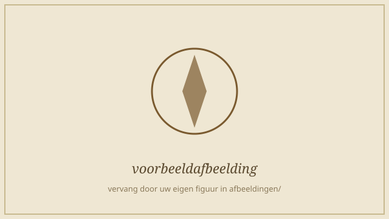

%%
================================================================================
 LEGENDA — opmaak van een editie.md
================================================================================
Een editie bestaat uit DRIE delen:
  1. De kop (frontmatter) tussen ---  en  --- : gegevens over de editie.
  2. De schone hoofdtekst.
  3. Een notenblok, ingeleid door een regel:  === NOTEN ===

Deze legenda staat in Obsidian-commentaar (procent-procent … procent-procent)
en wordt door de importer genegeerd.
Draai:  python3 importeer.py edities/voorbeeld/editie.md

--- DE KOP -------------------------------------------------------------------
  titel / auteur / jaar / bron      vrije tekst
  type                              handschrift  of  druk
  transcriptie                      kritisch / diplomatisch (informatief)
  regelnummering: 5                 optioneel; toont een nummer om de 5 regels
  origineel_type: afbeelding|pdf    voor de facsimilekoppeling (zie ~ hieronder)
  origineel_afbeeldingen: origineel/pagina-{n}.jpg
  origineel_pdf: origineel/handschrift.pdf
  apparaat: code | label | soort | zijde
        code   verwijst naar de noten (w, comm, krit, auteur, …)
        soort  editeur  of  origineel (auteursnoten)
        zijde  links of rechts (kantlijn); leeg = editeur links, origineel rechts

--- DE HOOFDTEKST ------------------------------------------------------------
  # / ## / ###          koppen, van groot naar klein
  (lege regel)          nieuwe alinea
  ~ label | doel        paginagrens; opent facsimile 'doel' (pdf-pagina of {n}).
                        Laat 'doel' leeg als er (nog) geen scan is.
      afbeelding met bijschrift (genummerd, klik = lightbox).
                        Blijft binnen de tekstkolom; {breed} = volledige kolombreedte:
                        {breed}
  Typografie:
     *cursief*                 **vet**
     {sc:kleinkapitaal}        {sp:gesperd}   (spatiëring, gangbaar in oude drukken)
     {sup:tekst}  superscript  {sub:tekst}  subscript
     {del:tekst}  doorhaling   {ul:tekst}   onderstreping uit de bron
  Editeursingrepen:
     {add:tekst}  toevoeging door de editeur  →  ⟨tekst⟩
     {unc:tekst}  onzekere lezing             →  tekst[?]
     {gap:reden}  lacune / onleesbaar         →  [reden]
     {ex:tekst}   opgeloste afkorting, heel woord (cursief; schakelbaar)
     Ho{ab:og}Mo{ab:genden}   opgeloste (aangevulde) letters binnen een woord;
                              in de editie cursief zónder haken: Hoogmogenden

  Bron- en handschriftkenmerken:
     {rood:tekst}   rubricatie (rode inkt)
     {init:tekst}   initiaal / lombarde (grote sierletter aan het begin)
     {itl:tekst}    interlineaire toevoeging — boven de regel geschreven; klein
                    en verhoogd, met invoegteken ‸ op de plaats van inlassing
     {marg:tekst}   marginale toevoeging — in de marge geschreven; als klein
                    inzetje in de tekststroom met een marge-merkteken

--- DE NOTEN (=== NOTEN ===) -------------------------------------------------
  Per regel:   lemma | code | inhoud
     lemma   het woord of de woordgroep in de tekst. Voor een lange passage:
             eerste woord … laatste woord   (met … of ...).
             Komt het lemma vaker voor? Kies met  lemma (2)  het 2e voorkomen.
     code    de apparaatcode uit de kop (w, comm, krit, auteur, …)
     inhoud  de noottekst. Mag *cursief* e.d. bevatten, en een GENESTE noot
             met  [[lemma|code|inhoud]]  (zie de auteursnoot hieronder).
  De hoofdtekst blijft schoon: de importer zoekt elk lemma op en verankert de
  noot. In de tekst wordt de volledige woordgroep onderstreept; in de kantlijn
  staat een lang lemma ingekort als «eerste … laatste».
  NESTING in de hoofdtekst: overlapt een commentaarnoot een woordverklaring
  (de ene ligt binnen de andere), dan nest de importer ze vanzelf.

--- HET REGISTER (=== REGISTER ===) ------------------------------------------
  Een optioneel blok, ingeleid door een regel  === REGISTER === , met per regel:
        soort | canonieke naam | variant, variant, …
     soort    persoon of plaats (bepaalt de groep in het register).
     naam     de gestandaardiseerde vorm die als kopje verschijnt.
     varianten alle schrijfwijzen zoals ze in het handschrift voorkomen,
              door komma's gescheiden. De canonieke naam hoeft niet herhaald.
  Het register verschijnt NIET in het notenapparaat. De site zoekt elke variant
  in de lopende tekst op, groepeert de vindplaatsen onder de canonieke naam en
  toont ze op een apart tabblad «Register». Klikken op een vindplaats opent de
  tekst en licht het woord op. Zo vang je afwijkende en inconsequente spelling
  onder één noemer, zonder de hoofdtekst te vervuilen.

--- WEERGAVE (voor de lezer) -------------------------------------------------
  Werkbalk: zoeken, een inhoudsopgave (knop Inhoud) met de kopjes, doorlopend
  lezen of per pagina bladeren, apparaten aan/uit, regelnummers,
  paginamarkeringen, en de kantlijnnoten (breed scherm) of het apparaat
  onderaan (smal scherm).
================================================================================
%%

# Proefeditie — overzicht van de opmaak

~ p. 1 |

## {sc:Typografie}

In de lopende tekst kan een woord *cursief* of **vet** staan, in {sc:kleinkapitaal} of {sp:gesperd}, met een superscript zoals den 3.{sup:e}, een subscript zoals in H{sub:2}O, een stuk {ul:onderstreping} uit de bron, of een {del:doorgehaalde} lezing die een schrapping toont.

## {sc:Editeursingrepen}

De editeur vult tekst aan tussen punthaken, zoals dit {add:aangevulde} woord, markeert een {unc:onzekere} lezing, en geeft een {gap:onleesbare passage} aan. Afkortingen worden opgelost — hetzij als heel woord, {ex:videlicet}, hetzij door alleen de aangevulde letters te tonen, zoals in de aanhef aan de Ho{ab:og}Mo{ab:genden} heeren.

## {sc:De vier apparaten}

Bij het woord kompas hoort een woordverklaring; bij Constantinopel een historische toelichting; bij deze lezing een tekstkritische aantekening; en bij dit sterretje een oorspronkelijke noot van de auteur. Een noot hoeft niet één woord te betreffen: zij kan een gehele zinsnede van het eerste tot het laatste woord omvatten.

Een commentaarnoot kan bovendien een lange passage bestrijken waarin zelf een woordverklaring genest is, zoals hier bij het woord galjoen dat midden in de becommentarieerde zin valt.

~ p. 2 |

## {sc:Bron- en handschriftkenmerken}

{init:D}eze alinea begint met een lombarde. Een {rood:rubriek} staat in rode inkt. Boven de regel is later {itl:tussengeschreven}, en in de marge staat {marg:een aantekening} van de kopiist.

### {sc:Bijzondere gevallen}

Het woord anker komt in deze alinea twee keer voor. De noot hoort bij het tweede anker, niet bij het eerste. Zo kies je met een telling het juiste voorkomen.

De schipper zag zich onderweg genoodzaakt eerst Constantinopolen aan te doen en daarna, met gunstige wind, opnieuw Constantinopel te bezoeken. Zulke wisselende schrijfwijzen brengt het register onder één noemer, met een verwijzing naar elke vindplaats.

=== NOTEN ===
kompas | w | instrument voor de navigatie.
Constantinopel | comm | Het huidige Istanbul; in de vroegmoderne tijd de hoofdstad van het Ottomaanse Rijk.
deze lezing | krit | hs.: deeze leezing; hier genormaliseerd naar de moderne spelling.
dit sterretje | auteur | Oorspronkelijke voetnoot van de auteur. De editeur tekent hierbij aan dat [[deze noot|comm|dit is een geneste editeursnoot, geplaatst óp de noot van de auteur]] van later datum lijkt.
van het eerste … laatste woord | w | Voorbeeld van een lemma dat meerdere woorden bestrijkt; in de kantlijn verschijnt het ingekort als «eerste … woord».
een lange passage bestrijken … becommentarieerde zin | comm | Voorbeeld van een commentaarnoot die een hele passage omvat; de woordverklaring galjoen staat er genest in.
galjoen | w | versierde boeg van een schip; ook het schip zelf.
anker (2) | comm | Deze noot is met «(2)» aan het tweede voorkomen van 'anker' gekoppeld.

=== REGISTER ===
# soort | canonieke naam | variant, variant, …
plaats | Constantinopel | Constantinopel, Constantinopolen
